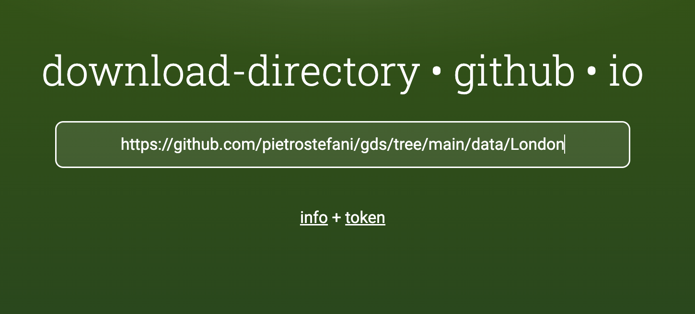
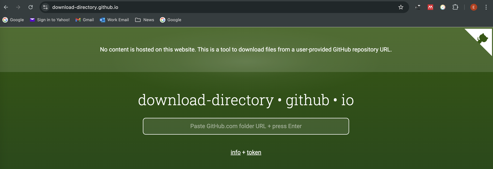
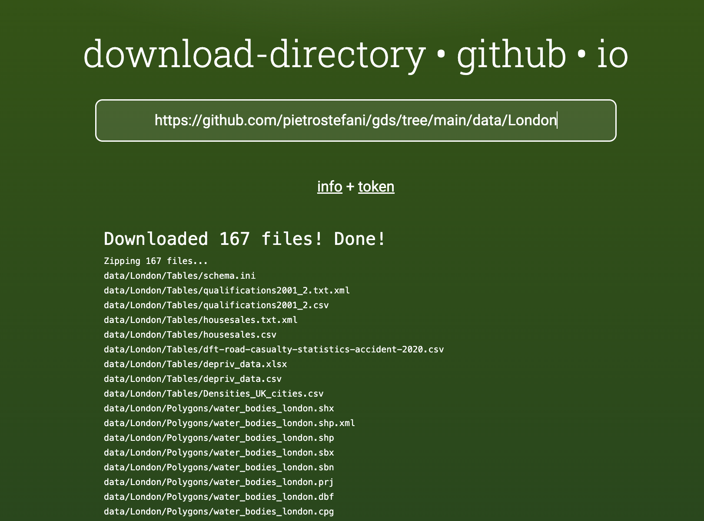

# Download data from GitHub {.unnumbered}

The data for each lab is stored in the course GitHub repository, in the [`data`](https://github.com/pietrostefani/gds/tree/main/data) folder. Download the folder for each lab at the start of that week, rather than all the data at once, so you always have the latest version. Save it inside the `data` folder of your course folder, so that the relative paths in the lab code work (see the set-up page for [R](environR.qmd#working-in-quarto-documents-with-relative-paths) or [Python](environPy.qmd#set-up-your-course-folder)).

::: callout-important
Where you save the data matters. Each lab reads its files with a relative path such as `"data/London/Tables/Densities_UK_cities.csv"`. That path only works if your course folder looks like this:

```         
envs363_563/
├── data/
│   └── London/
│       └── ...
└── lab_01.qmd  (or lab_01.ipynb)
```
:::

## Download one data folder

GitHub doesn't let you download a single folder directly, so we use [download-directory.github.io](https://download-directory.github.io), a free tool that packages a GitHub folder into a zip file.

1.  On GitHub, open the data folder you need for your lab and copy its address from your browser's address bar. For example, for the London data: <https://github.com/pietrostefani/gds/tree/main/data/London>

    {width="60%"}

2.  Go to <https://download-directory.github.io>, paste the address into the box and press **Enter**. The download starts automatically once the zip file is ready. Larger folders can take a few minutes, so keep the tab open.

    {width="70%"}

3.  Find the zip file in your **Downloads** folder and unzip it:

    - **Windows**: right-click the file and choose **Extract All**. Don't just double-click it: Windows lets you look inside a zip file without extracting it, but R cannot read files from there.
    - **macOS**: double-click the file. Safari may unzip it for you automatically.

    {width="60%"}

4.  Move the unzipped folder into the `data` folder of your course folder, and rename it if needed so it matches the name used in the lab (e.g. `London`, not `gds-main-data-London`). If you already have a folder with that name from an earlier lab, replace it with the new one.

5.  Check that it's in the right place: in RStudio, open the **Files** pane and navigate to `data/London`. You should see the lab files inside it, not another folder with the same name.

## If download-directory doesn't work

If download-directory stalls or gives an error, wait a few minutes and try again: GitHub limits how many requests the tool can make in a short time, so it usually works on a second attempt. If a folder only has a few files, you can also download them one by one: open each file on GitHub and click the **Download raw file** button (the download arrow at the top right of the file view), then save it in the right folder inside `data`.

::: callout-warning
Don't download the whole repository once at the start of term and reuse it. Data folders may be updated during the course (for example, to fix a file or add data for a lab), and an old copy may no longer match the lab code. Download the folder for each lab when you start that lab, so you always have the latest version.
:::
