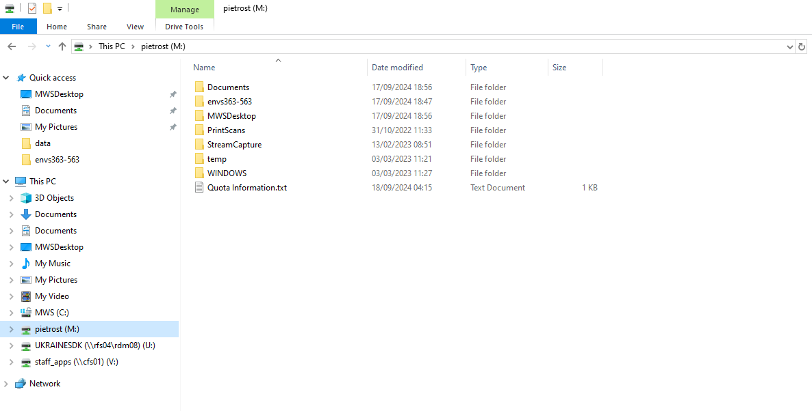
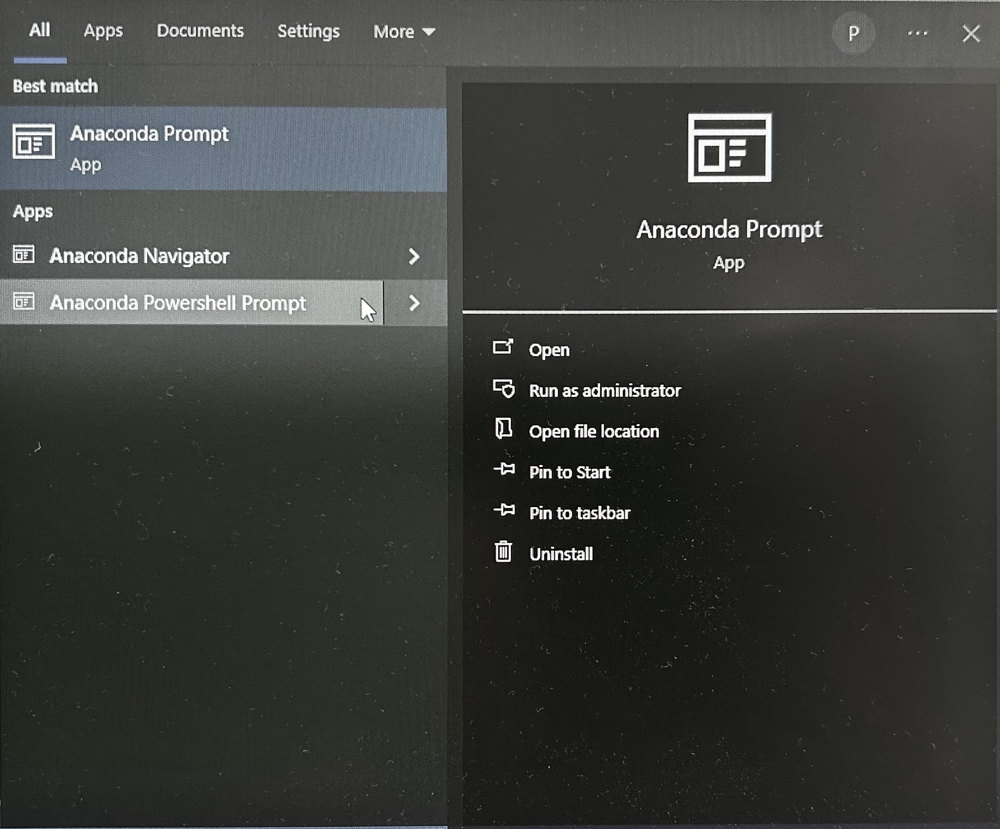
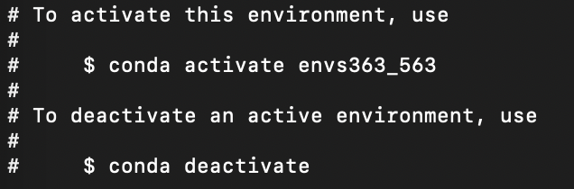
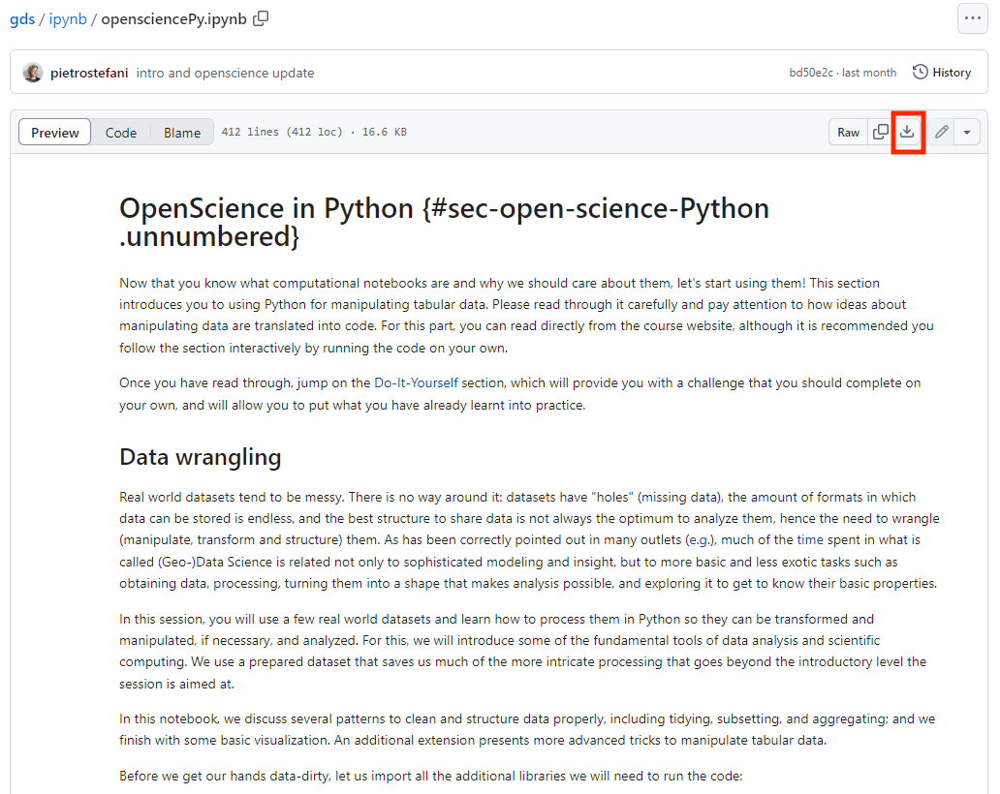
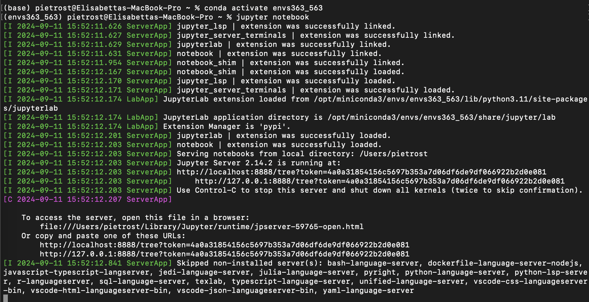
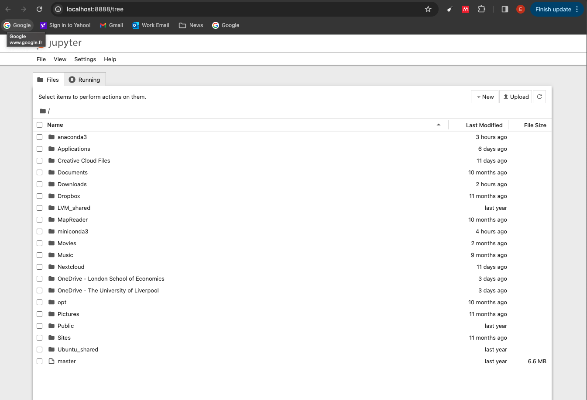

# Python {.unnumbered}

This page has two parts:

1.  [**Setting up your environment**](#setting-up-your-environment-py): installing Miniforge, organising your course folder, installing all the packages used in the course, and running the labs in **Jupyter Notebook**. **Everyone following the course in Python needs to complete this part before the first lab.** If something goes wrong, see [Troubleshooting](#troubleshooting-py).
2.  [**Python basics**](#python-basics): where to learn the basics if you are new to Python.

::: callout-important
## All Python work in this course happens in Jupyter Notebook

**Jupyter Notebook** is a program that runs in your web browser and opens notebook files (`.ipynb`). Every lab is a notebook: it mixes explanations with code cells that you run one at a time, and shows the results (tables, maps, plots) directly underneath each cell.

**Do not** run the Python code in RStudio. Always open the lab notebooks in Jupyter Notebook, started from the course environment you create on this page.
:::

## Setting up your environment {#setting-up-your-environment-py}

In Python, all the packages for the course are installed together in one **environment**, described in a single file: `envs363_563.yml`. You install this environment once, and then activate it every time you work on the labs. We use **Miniforge** to create and manage it. The environment also installs **Jupyter Notebook**, which you use to open and run the labs.

In short, you will do this once:

- install Miniforge, set up your course folder, and install the course environment;

and this every time you work on a lab:

- activate the environment, start Jupyter Notebook from your course folder, and open the lab notebook.

The steps are:

1.  [Install Miniforge](#install-miniforge)
2.  [Set up your course folder](#set-up-your-course-folder)
3.  [Install the course environment](#install-the-course-environment)
4.  [Open a lab in Jupyter Notebook](#start-a-lab-session)

Work through them in order and test your installation **before the first lab**. If you run into problems, check [Troubleshooting](#troubleshooting-py) at the end of this part, and if that doesn't help, post a message on the module's Microsoft Teams channel.

### 1. Install Miniforge {#install-miniforge}

Miniforge is a free, lightweight installer for `conda`, the tool we use to manage Python environments. It downloads packages from the community-run **conda-forge** channel.

::: panel-tabset
## Windows

1.  Download the Windows installer (`Miniforge3-Windows-x86_64.exe`) from the [Miniforge download page](https://conda-forge.org/download/).
2.  Double-click it and keep the default settings. When asked whom to install it for, choose **Just Me**.
3.  When it has finished, search for **Miniforge Prompt** in the Start menu. This is the terminal you will use for everything on this page.

## macOS

On a Mac, Miniforge is installed from the **Terminal** app (search for it with Spotlight, `Cmd + Space`).

1.  Go to your Downloads folder and download the installer. The `$(uname)` and `$(uname -m)` parts pick the right version for your Mac automatically:

    ``` bash
    cd ~/Downloads
    curl -L -O "https://github.com/conda-forge/miniforge/releases/latest/download/Miniforge3-$(uname)-$(uname -m).sh"
    ```

2.  Run the installer:

    ``` bash
    bash Miniforge3-$(uname)-$(uname -m).sh
    ```

3.  Answer the installer's questions:

    - Press **Enter** to show the licence, then scroll to the end (keep pressing **Space**, or press **q**).
    - Type `yes` to accept the licence.
    - Press **Enter** to accept the install location (`/Users/yourname/miniforge3`).
    - Type `yes` when asked whether to initialize conda.

    When you see `Thank you for installing Miniforge3!`, the installation is complete.

4.  **Close the Terminal window and open a new one.** Then check which conda is active:

    ``` bash
    conda info | grep -i "base environment"
    ```

    The path should include `miniforge3`. If it shows `anaconda3` or `miniconda3` instead, see [Troubleshooting](#troubleshooting-py).
:::

::: callout-note
## Already have Anaconda or Miniconda?

You can keep using it: the course environment file only uses the conda-forge channel. If you install Miniforge as well, check which one your terminal uses (see [Troubleshooting](#troubleshooting-py)). If `conda` asks you to accept Anaconda's Terms of Service, see the Troubleshooting section too.
:::

::: callout-caution
## University machines

Anaconda is pre-installed on many university machines. If it isn't on yours, install it from **Install University Applications** (search for `Anaconda`). If you work on university machines:

1.  Choose a machine where Anaconda is already installed.
2.  Always use the same machine (e.g. CT60, Station 17, Orange Zone). The environment is installed on that machine only, so if you change machine you will need to install it again.
3.  Keep your course folder on your `M:\` drive, so your files are available from any machine.
:::

### 2. Set up your course folder {#set-up-your-course-folder}

1.  Create a folder for all your work on this course, called `envs363_563`. You can put it wherever you like (on a university machine, put it in `M:\`). Avoid spaces and special characters in the folder name and in the path to it.

    {width="90%"}

2.  Inside it, create a folder called `data`.

3.  At the start of each lab, download that lab's data folder into `data` (see [Download data from GitHub](download.qmd)), and save that lab's notebook directly in `envs363_563`.

Your course folder should look like this:

```         
envs363_563/
├── data/
│   └── London/
│       └── ...
├── envs363_563.yml
├── spatialdataPy.ipynb
└── ...
```

::: callout-important
## Keep your notebooks next to the `data` folder

The lab notebooks read data with **relative paths** such as `"data/London/Tables/housesales.csv"`. A notebook looks for these paths starting from the folder it is saved in, so the paths only work if the notebook sits in the same folder as `data`. If you save a notebook in a subfolder, it won't find the data.
:::

### 3. Install the course environment {#install-the-course-environment}

1.  Open the [environment file on GitHub](https://github.com/pietrostefani/gds/blob/main/envs363_563.yml), click **Download raw file** (the download arrow at the top right), and save `envs363_563.yml` in your `envs363_563` folder.

2.  Open a terminal:

::: panel-tabset
## Windows

Search for **Miniforge Prompt** in the Start menu and open it. On a university machine, open **Anaconda Prompt** instead.

{width="60%"}

## macOS

Open the **Terminal** app (search for it with Spotlight, `Cmd + Space`).
:::

3.  Move into your course folder with the `cd` ("change directory") command, followed by the path to your folder:

::: panel-tabset
## Windows

``` bash
cd /d M:\envs363_563
```

Replace `M:\envs363_563` with the path to your folder. The `/d` lets you switch drive (e.g. from `C:` to `M:`) at the same time. Tip: you can type `cd /d` followed by a space, then drag the folder from File Explorer into the prompt to paste its path.

## macOS

``` bash
cd ~/Desktop/envs363_563
```

Replace `~/Desktop/envs363_563` with the path to your folder. Tip: you can type `cd` followed by a space, then drag the folder from Finder into the Terminal to paste its path.
:::

4.  Create the environment from the file:

    ``` bash
    conda env create -f envs363_563.yml
    ```

    If you are asked any questions, type `y` and press **Enter**. This installs all the packages used in the course, and can take 10 to 20 minutes.

5.  Activate the environment:

    ``` bash
    conda activate envs363_563
    ```

    The start of the line in your terminal should change from `(base)` to `(envs363_563)`. This tells you the environment is active.

    {width="50%"}

6.  Check that everything installed correctly:

    ``` bash
    python -c "import geopandas, pysal, osmnx, rasterio, contextily; print('All good!')"
    ```

    If this prints `All good!`, you are all set. If it prints an error, copy the full message into your post on Teams.

#### Packages in the course environment

The main packages used in this course are listed below, grouped by what they are used for. The environment file installs them all, together with the packages they depend on. You don't need to install anything separately.

| Purpose | Packages |
|----|----|
| Data handling | `pandas`, `numpy`, `scipy` |
| Spatial vector data | `geopandas`, `shapely`, `pyproj`, `pyogrio`, `fiona`, `rtree` |
| Raster data | `rasterio`, `rioxarray`, `xarray`, `rasterstats`, `elevation` |
| Maps and plots | `matplotlib`, `seaborn`, `contextily`, `folium`, `mapclassify` |
| Spatial statistics (PySAL) | `pysal`, `libpysal`, `esda`, `spreg`, `mgwr`, `pointpats`, `splot`, `giddy`, `inequality`, `segregation`, `tobler`, `spopt`, `access` |
| Statistics and machine learning | `statsmodels`, `scikit-learn` |
| Networks and urban form | `networkx`, `osmnx`, `momepy`, `spaghetti` |
| Web data and geocoding | `requests`, `beautifulsoup4`, `geopy` |
| Jupyter | `jupyter`, `notebook`, `jupyterlab`, `ipykernel`, `ipywidgets` |

The exact version of every package is listed in [`envs363_563.yml`](https://github.com/pietrostefani/gds/blob/main/envs363_563.yml).

::: callout-tip
## Updating or reinstalling the environment

If we announce an update to the environment file during the course, download the new `envs363_563.yml` into your course folder, `cd` into the folder, and run:

``` bash
conda env update -f envs363_563.yml --prune
```

If your environment gets into a mess, you can delete it and start again with `conda env remove -n envs363_563`, followed by step 4 above.
:::

### 4. Open a lab in Jupyter Notebook {#start-a-lab-session}

You need to do this **every time** you work on a lab.

1.  Download the lab notebook (`.ipynb`) from the [`ipynb` folder of the course repository](https://github.com/pietrostefani/gds/tree/main/ipynb): open the notebook and click **Download raw file**. Save it directly in your `envs363_563` folder, not in a subfolder.

    {width="80%"}

2.  Download that lab's data into your `data` folder (see [Download data from GitHub](download.qmd)).

3.  Open a terminal (**Miniforge Prompt** or **Anaconda Prompt** on Windows, **Terminal** on macOS) and move into your course folder with `cd`, as in step 3 of [Install the course environment](#install-the-course-environment).

4.  Activate the environment and start **Jupyter Notebook**:

    ``` bash
    conda activate envs363_563
    jupyter notebook
    ```

    Jupyter Notebook opens in your web browser, showing the files in your course folder. It runs in the browser but works from your computer, so you don't need to be online to use it. Keep the terminal open while you work: closing it stops Jupyter Notebook.

    {width="90%"}

5.  Click on the lab notebook (`.ipynb`) to open it in a new tab.

    {width="80%"}

6.  Work through the notebook from top to bottom (see [Working in a notebook](#working-in-a-notebook) below).

7.  When you have finished, save the notebook (**File \> Save**, or `Ctrl + S` / `Cmd + S`), close the browser tabs, and press `Ctrl + C` in the terminal to stop Jupyter Notebook.

::: callout-note
Starting Jupyter from your course folder is what makes the relative paths work: Jupyter only shows files inside the folder it was started from. If you can't see your notebook, close Jupyter, `cd` into your course folder, and start it again.
:::

#### Working in a notebook {#working-in-a-notebook}

A notebook is made of **cells**, stacked one under the other. There are two kinds:

- **Markdown cells** contain the text of the lab: explanations, instructions and questions.
- **Code cells** contain Python code. They have `[ ]:` to their left. When you run one, its output appears directly underneath, and a number appears in the brackets (e.g. `[3]:`) showing the order in which cells were run.

The essentials:

| To... | Do this |
|----|----|
| Run a cell and move to the next one | Click in the cell and press `Shift + Enter` (or click **▶ Run** in the toolbar) |
| Edit a cell | Click inside it (code cells) or double-click it (markdown cells) |
| Add a new cell | Click **+** in the toolbar |
| Change a cell between code and markdown | Use the drop-down menu in the toolbar |
| Start again from a clean slate | **Kernel \> Restart Kernel and Run All Cells** |
| Save | `Ctrl + S` (Windows) or `Cmd + S` (macOS) |

::: callout-tip
## Run cells in order

Each code cell can use results from the cells above it (e.g. data loaded earlier in the notebook). If you skip a cell, or jump around, you will get errors such as `NameError: name 'districts' is not defined`. When in doubt, restart and run all cells from the top.

While a cell is running, its brackets show `[*]`. Wait for it to finish before running the next one.
:::

## Troubleshooting {#troubleshooting-py}

Most set-up problems are one of the ones below. Click on a problem to see how to fix it.

### Installing Miniforge

::: {.callout-note collapse="true"}
## `No such file or directory` when running the installer (macOS)

The Terminal is not in the folder where the installer is saved. New Terminal windows open in your home folder, not in Downloads. Move to Downloads and check the file is there:

``` bash
cd ~/Downloads
ls Miniforge*
```

If `ls` lists the file, run the installer again. If the file name is different, for example because your browser added `(1)` to it, type the name exactly as shown, in quotes:

``` bash
bash "Miniforge3-Darwin-arm64 (1).sh"
```

If `ls` finds nothing, download the installer with the `curl` command in [Install Miniforge](#install-miniforge).
:::

::: {.callout-note collapse="true"}
## `conda: command not found` after installing

- **macOS**: close the Terminal and open a new window, because the installation only takes effect in new windows. If it still doesn't work, you probably answered `no` when asked to initialize conda. Fix it with the command below, then open a new window:

  ``` bash
  ~/miniforge3/bin/conda init zsh
  ```

- **Windows**: make sure you are using **Miniforge Prompt** from the Start menu, not the standard Command Prompt or PowerShell.
:::

::: {.callout-note collapse="true"}
## I already had Anaconda or Miniconda, and the old conda is still being used (macOS)

If you used Python before, your Terminal may still start your old installation. You can tell because this command shows `anaconda3` or `miniconda3` instead of `miniforge3`:

``` bash
conda info | grep -i "base environment"
```

To switch to Miniforge, remove the old set-up from your Terminal and set up Miniforge instead (replace `anaconda3` with `miniconda3` if that's what you had):

``` bash
~/anaconda3/bin/conda init --reverse zsh
~/miniforge3/bin/conda init zsh
```

Close the Terminal, open a new window, and run the check again. It should now show `miniforge3`. Your old installation is still on your computer. You can uninstall it later if you no longer need it.
:::

### Creating the environment

::: {.callout-note collapse="true"}
## `EnvironmentFileNotFound` or `No such file` when creating the environment

`conda` can't find `envs363_563.yml` in the folder you are in. Check which files are in the current folder with `ls` (macOS) or `dir` (Windows).

- If you don't see `envs363_563.yml`, you are in the wrong folder. `cd` into your course folder (see [step 3](#install-the-course-environment)).
- If you see `envs363_563.yml.txt` or `envs363_563.yaml`, your browser renamed the file on download. Rename it to exactly `envs363_563.yml`. On Windows, file extensions are hidden by default: turn them on in File Explorer under **View \> Show \> File name extensions** to see the full name.
:::

::: {.callout-note collapse="true"}
## `Terms of Service have not been accepted` (`CondaToSNonInteractiveError`)

You are using the `conda` from Anaconda or Miniconda, not from Miniforge. On Windows, open **Miniforge Prompt** instead. On macOS, see *I already had Anaconda or Miniconda* above.

If you want to keep using Anaconda or Miniconda, you can instead tell conda to stop using Anaconda's channels, then try again:

``` bash
conda config --remove channels defaults
```
:::

::: {.callout-note collapse="true"}
## The installation stopped with an error, or the environment already exists

The installation downloads a lot of packages, so it can fail if your internet connection drops. Delete the half-installed environment and start again:

``` bash
conda env remove -n envs363_563
conda env create -f envs363_563.yml
```

If it fails again at the same point, copy the **full** error message from the terminal into a post on Teams.
:::

### Running the notebooks

::: {.callout-note collapse="true"}
## `ModuleNotFoundError: No module named 'geopandas'` (or another package)

The notebook is not running in the course environment. This usually means Jupyter was started before activating the environment. Close Jupyter (`Ctrl + C` in the terminal), then run:

``` bash
conda activate envs363_563
jupyter notebook
```

The start of the line in the terminal should show `(envs363_563)`, not `(base)`. To check from inside a notebook, run `import sys; print(sys.executable)`: the path should include `envs363_563`.
:::

::: {.callout-note collapse="true"}
## `FileNotFoundError`, `No such file`, or `DataSourceError` when loading data

The notebook can't find the data at the relative path in the code (e.g. `data/London/...`). Check that:

- the notebook is saved directly in your `envs363_563` folder, not in a subfolder;
- the lab's data is in `envs363_563/data/`, with the folder name matching the path in the code (e.g. `London`);
- there is no extra folder in between, e.g. `data/London/London/`, which can happen when unzipping.

See [Set up your course folder](#set-up-your-course-folder) and [Download data from GitHub](download.qmd).
:::

::: {.callout-note collapse="true"}
## Jupyter started but no browser window opened, or I can't see my notebook

If no browser window opened, look in the terminal for a line starting with `http://localhost:8888/` and copy the full address, including the `?token=...` part, into your browser.

If Jupyter opens but you can't see your notebook, Jupyter was started from the wrong folder: it only shows files inside the folder it was started from. Close it (`Ctrl + C`), `cd` into your course folder, and start it again.
:::

### Asking for help

If you're still stuck, post on the module's Teams channel and include:

1.  your operating system (Windows or macOS) and whether you are on a university machine;
2.  the step you were on;
3.  the **full** error message, copied and pasted as text from the terminal (not a photo of the screen);
4.  the output of `conda info`.

## Python basics {#python-basics}

If you are new to Python, work through the tutorials in the **Learn the Basics** section of [learnpython.org](https://www.learnpython.org/en/Welcome) before the first lab. If you have used Python before, you can skip them.

## Resources

Some help along the way with:

1.  [Geographic Data Science with Python](https://geographicdata.science/book/intro.html) by Sergio Rey, Dani Arribas-Bel and Levi John Wolf.

2.  [Python for Geographic Data Analysis](https://pythongis.org/index.html) by Henrikki Tenkanen, Vuokko Heikinheimo and David Whipp.

3.  [Jupyter Notebook documentation](https://docs.jupyter.org/en/latest/) for working with notebooks.
