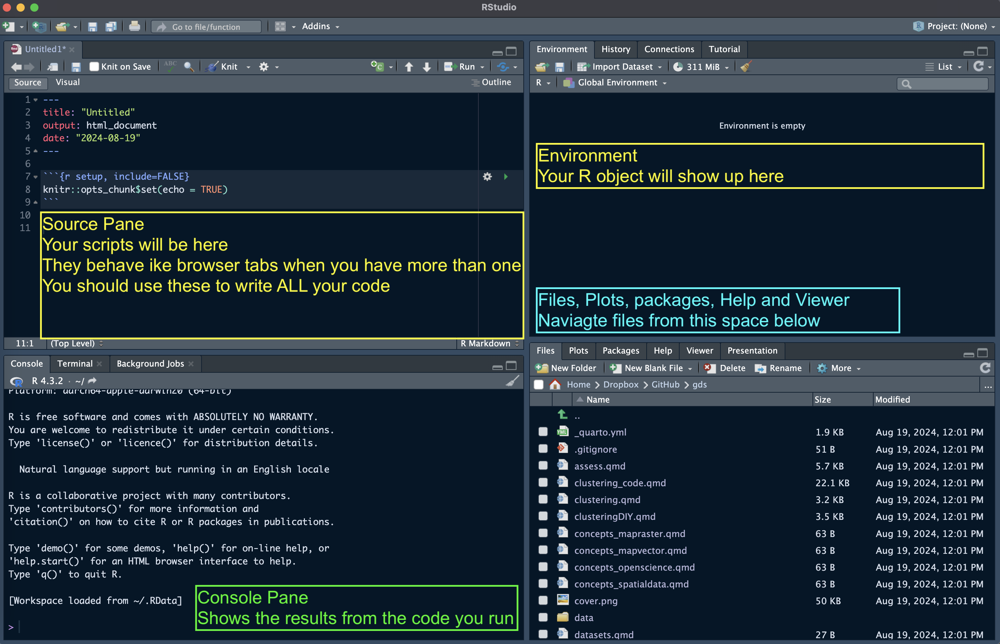
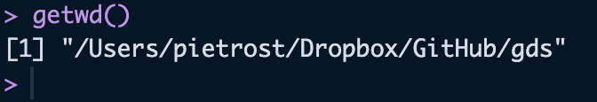

---
format:
  html:
    code-fold: true
---

# R {.unnumbered}

This page has two parts:

1.  [**Setting up your environment**](#setting-up-your-environment-r): installing R, RStudio and Quarto, learning how we organise files and paths, and installing all the packages used in the course. **Everyone needs to complete this part before the first lab.**
2.  [**R basics**](#r-basics): a short introduction to R objects, data types and data structures. If you are new to R, work through it before the first lab. If you have used R before, skim it as a refresher.

## Setting up your environment {#setting-up-your-environment-r}

### Software

To run the code in this course in R, you need the following software:

- **R**: the latest release (version 4.5 or later)
- **RStudio Desktop**: the latest release
- **Quarto**: bundled with recent versions of RStudio, so you normally don't need to install it separately
- The R packages listed in [Installing packages](#installing-packages-r) below

To install or update:

- R: download the version for your operating system from [The Comprehensive R Archive Network (CRAN)](https://cran.r-project.org)
- RStudio: download it from [Posit](https://posit.co/download/rstudio-desktop/)
- Quarto (only if you need a standalone install): download it from [quarto.org](https://quarto.org/docs/get-started/)

To check your version of:

- R and loaded packages: run `sessionInfo()` in the Console
- RStudio: click `Help` on the menu bar and then `About RStudio`
- Quarto: in the RStudio **Terminal** tab (not the Console), run `quarto --version`

### RStudio

Upon startup, RStudio will look something like this. The **Pane Layout** and **Appearance** settings can be changed under Tools \> Global Options \> Pane Layout and Tools \> Global Options \> Appearance (on macOS, this is also available under RStudio \> Settings). I personally like to have my Console in the top right corner and Environment in the bottom left, and keep the Source and Environment panes wider than Console and Files for easier readability. Default settings will probably have the Console in the bottom left and Environment in the top right. You will also have a standard white background, but you can choose a different editor theme under Appearance.



At the start of a session, it's good practice to start from a clean R environment. You can clear all objects with:

```{r}
#| code-fold: show
rm(list = ls())
```

::: callout-tip
To make sure every session starts clean, go to Tools \> Global Options \> General and untick **Restore .RData into workspace at startup**, and set **Save workspace to .RData on exit** to *Never*.
:::

### Working in Quarto documents with relative paths

In this course we write all our code in **Quarto documents** (`.qmd`) rather than R scripts (`.R`). A Quarto document lets you mix text, code and outputs (tables, maps, plots) in one file, and render it to an HTML page with the **Render** button. This is also the format you will use for your assignments, which are submitted as HTML files, so getting used to it now will make things much easier later.

We also work with **relative paths**, which means file paths are written relative to where your document is saved (e.g. `data/London/Tables/...`) rather than as full paths on your computer (e.g. `C:/Users/yourname/Documents/...`). Relative paths mean your code keeps working if you move the course folder, and it will run on someone else's computer too.

The key rule is simple: **code in a Quarto document runs from the folder where the `.qmd` file is saved**. So you don't need `setwd()`; you just need to save your `.qmd` in the right place. The easiest set-up is to save your `.qmd` files in the main course folder, next to the `data` folder:

```         
envs363_563/
├── data/
│   └── London/
│       └── Tables/
│           └── Densities_UK_cities.csv
├── lab_01.qmd
└── lab_02.qmd
```

From `lab_01.qmd`, the path to the csv file is then simply `"data/London/Tables/Densities_UK_cities.csv"`. If you prefer to keep your `.qmd` files in a subfolder (e.g. `labs/`), use `..` to go up one level first: `"../data/London/Tables/Densities_UK_cities.csv"`.

To create a new Quarto document in RStudio, go to File \> New File \> Quarto Document..., then save it in your course folder. You can check which folder your code is running from by running `getwd()` in a code chunk:

```{r}
#| code-fold: show
#| results: hide
getwd()
```



::: callout-tip
Opening the course folder as an **RStudio Project** (File \> New Project \> Existing Directory) keeps the Files pane, Console and Terminal pointed at your course folder, which makes it easier to find your files. Open it by double-clicking the `.Rproj` file.
:::

::: callout-important
Avoid `setwd()` and full paths (e.g. `"C:/Users/yourname/..."` or `"~/Desktop/..."`) in your Quarto documents. They will break as soon as the file is moved or opened on another computer, including when your assignment is marked.
:::

### Installing packages {#installing-packages-r}

In R, packages are collections of functions, compiled code and sample data. They act as "extensions" to the base R language and cover almost anything you might want to do in R (and if no package serves your purpose, you can write your own!).

There are two steps to using a package, and it helps to keep them apart:

- A package only needs to be **installed once** on your computer, with `install.packages()`. Run this in the Console, not in your `.qmd`, otherwise R will try to reinstall the package every time you render your document.
- A package needs to be **loaded** with `library()` every time you start a new R session or render a Quarto document. This goes at the top of your `.qmd`.

```{r}
#| code-fold: show
#| eval: false
# Run once, in the Console
install.packages("tidyverse")
```

```{r}
#| code-fold: show
# At the top of every .qmd that uses it
library(tidyverse)
```

The packages used in this course are listed below, grouped by what they are used for:

| Purpose | Packages |
|----|----|
| Data wrangling | `tidyverse`, `dplyr`, `tidyr`, `tibble`, `readr`, `data.table`, `R.utils` |
| Spatial vector data | `sf`, `geojsonsf`, `osmdata` |
| Raster data | `terra`, `raster`, `exactextractr`, `tidyterra` |
| Maps and plots | `tmap`, `ggplot2`, `ggspatial`, `mapview`, `basemapR`, `rosm`, `patchwork`, `GGally` |
| Colours and classification | `RColorBrewer`, `viridis`, `colorspace`, `classInt` |
| Spatial statistics | `spdep`, `rgeoda`, `gstat`, `spatstat`, `eks` |
| Clustering | `cluster`, `dbscan`, `fpc` |
| Networks | `igraph`, `tidygraph` |

Install all of them by running the code below in the RStudio **Console**. It only installs the packages you don't already have, so it is safe to run more than once. The first run can take a while.

```{r}
#| code-fold: show
#| eval: false

# Packages available on CRAN
cran_packages <- c(
  "tidyverse", "data.table", "sf", "tmap", "readr", "geojsonsf", "osmdata",
  "RColorBrewer", "classInt", "R.utils", "dplyr", "ggplot2", "viridis",
  "raster", "terra", "exactextractr", "tidyterra", "spdep", "tibble",
  "patchwork", "rosm", "tidyr", "GGally", "cluster", "rgeoda", "mapview",
  "ggspatial", "colorspace", "gstat", "spatstat", "dbscan", "fpc", "eks",
  "igraph", "tidygraph", "remotes"
)

# Install any CRAN packages that are missing
missing_packages <- setdiff(cran_packages, rownames(installed.packages()))
if (length(missing_packages) > 0) install.packages(missing_packages)

# basemapR is not on CRAN, so it is installed from GitHub
if (!requireNamespace("basemapR", quietly = TRUE)) {
  remotes::install_github("Chrisjb/basemapR")
}
```

To check that everything installed correctly, run:

```{r}
#| code-fold: show
#| eval: false
all_packages <- c(cran_packages, "basemapR")
setdiff(all_packages, rownames(installed.packages()))
```

If this returns `character(0)`, you are all set. If it lists any package names, try installing those individually with `install.packages("name")` and read the error message in the Console. If R asks whether you want to install from source a package that needs compilation, answering *No* usually works and is faster.

## R basics {#r-basics}

::: callout-note
This part is an introduction to R for those who are new to it, or a refresher if you have used R before. Run the code chunks in a `.qmd` document of your own as you go.
:::

### Using the console

Try to use the console to perform a few operations. For example type in:

```{r}
#| code-fold: show
1 + 1
```

Slightly more complicated:

```{r}
#| code-fold: show
print("hello world")
```

If you are unsure about what a command does, use the "Help" panel in your Files pane or type `?function` in the console. For example, to see how the `dplyr::rename()` function works, type in `?dplyr::rename`. The double colon syntax in that command calls a function from a package without loading the whole package with `library()`.

### R Objects

Everything in R is an **object**. R possesses a simple generic **function** mechanism which can be used for an object-oriented style of programming. Indeed, everything that happens in R is the **result of a function call** [(John M. Chambers)](https://www.r-bloggers.com/2018/06/three-deep-truths-about-r/). Method dispatch takes place based on the class of the first argument to the generic function.

All R statements where you create objects -- "assignments" -- have this form: `object_name <- value`. Assignment can also be performed using `=` instead of `<-`, but the standard advice is to use the latter syntax [(see e.g. The R Inferno, ch. 8.2.26)](https://www.burns-stat.com/pages/Tutor/R_inferno.pdf). In RStudio, the standard shortcut for the assignment operator `<-` is **Alt + -** (Windows) or **Option + -** (macOS).

A mock assignment of the value `30` to the name `age` is reported below. In order to inspect the content of the newly created variable, it is sufficient to type the name into the console. Within R, the hash symbol `#` is used to write comments.

```{r}
#| code-fold: show
age <- 30 # Assign the number 30 to the name "age"
age # print the variable "age" to the console
```

### A small note on variable types

The function `class()` is used to inspect the type of an object.

There are four main types of variables:

- **Logical**: boolean/binary, can either be `TRUE` or `FALSE`

```{r}
#| code-fold: show
class(TRUE)
```

- **Character (or string)**: simple text, including symbols and numbers. It can be wrapped in single or double quotation marks, which usually highlights text in a different colour in RStudio

```{r}
#| code-fold: show
class("I am a city")
```

- **Numeric**: Numbers. Mathematical operators can be used here.

```{r}
#| code-fold: show
class(2022)
```

- **Factor**: Characters or strings, but ordered in categories.

```{r}
#| code-fold: show
class(as.factor(c("I", "am", "a", "factor")))
```

Another important value to know is `NA`. It stands for "Not Available" and simply denotes a missing value.

```{r}
#| code-fold: show
vector_with_missing <- c(NA, 1, 2, NA)
vector_with_missing
```

### Logical operators and expressions

- `==` asks whether two values are the same or equal ("is equal to")
- `!=` asks whether two values are not the same or unequal ("is not equal to")
- `>` greater than
- `<` smaller than
- `>=` greater or equal to
- `<=` smaller or equal to
- `&` stands for "and" (unsurprisingly)
- `|` stands for "or"
- `!` stands for "not"

### A first example

Let's create some R objects:

```{r}
#| code-fold: show
# Population and area of two cities
London <- 8982000 # population
Bristol <- 467099 # population
London_area <- 1572 # area km2
Bristol_area <- 110 # area km2

London
```

Calculate population density in London and Bristol:

```{r}
#| code-fold: show
London_pop_dens <- London / London_area
Bristol_pop_dens <- Bristol / Bristol_area

London_pop_dens
```

The function `c()`, which you will use extensively if you keep coding in R, means "concatenate" (or "combine"). In this case, we use it to create a vector of population densities for London and Bristol:

```{r}
#| code-fold: show
c(London_pop_dens, Bristol_pop_dens)
pop_density <- c(London_pop_dens, Bristol_pop_dens)
```

Create a character variable:

```{r}
#| code-fold: show
x <- "a city"
class(x)
typeof(x)
length(x)
```

### Data Structures

Objects in R are typically stored in **data structures**. There are multiple types of data structures:

#### Vectors

In R, a vector is a sequence of elements which **share the same data type**. A vector supports logical, integer, double, character, complex, or raw data types.

```{r}
#| code-fold: show
# first vector y
y <- 1:10
class(y)      # 1:10 creates an integer vector
as.numeric(y) # returns a numeric copy; y itself is unchanged
length(y)

# another vector z
z <- c(2, 4, 56, 4)
z

# and another one called cities
cities <- c("London", "Bristol", "Bath")
cities
```

#### Matrices

Two-dimensional, rectangular, and homogeneous data structures. They are similar to vectors, with the additional attribute of having two dimensions: the number of rows and columns.

```{r}
#| code-fold: show
m <- matrix(nrow = 2, ncol = 2)
m

n <- matrix(c(4, 5, 78, 56), nrow = 2, ncol = 2)
n
```

#### Lists

Lists are containers which can store elements of different types and sizes. A list can contain vectors, matrices, data frames, other lists, and functions, which can be accessed, unlisted, and assigned to other objects.

```{r}
#| code-fold: show
list_data <- list("Red", "Green", c(21, 32, 11), TRUE, 51.23, 119.1)
print(list_data)
```

#### Data frames

They are the most common way of storing data in R and are the most used data structure for statistical analysis. Data frames are "rectangular lists", i.e. tabular structures in which **every column has the same length**, and can also be thought of as lists of equal-length vectors.

```{r}
#| code-fold: show
# A data frame of 3 columns named id, x, y and 10 rows
dat <- data.frame(id = letters[1:10], x = 1:10, y = 11:20)
dat

head(dat) # read the first 6 rows
tail(dat) # read the last 6 rows

names(dat)
```

Data frames in R are indexed by row and column numbers using the `[rows, cols]` syntax. The `$` operator allows you to access columns in the data frame, or to create new columns in the data frame.

```{r}
#| code-fold: show
dat[1, ] # read first row and all columns
dat[, 1] # read all rows and the first column
dat[6, 3] # read 6th row, third column
dat[c(2:4), ] # read rows 2 to 4 and all columns

dat$y # read column y
dat[dat$x < 7, ] # read rows that have an x value less than 7
dat$new_column <- runif(10, 0, 1) # create a new variable called "new_column"

dat
```

### Importing data from a csv file

To read a csv file we use `read_csv()` from the `readr` package, which is part of the `tidyverse` we loaded with `library(tidyverse)` in [Installing packages](#installing-packages-r). Note the relative path: it works because this `.qmd` is saved in the course folder, next to the `data` folder.

```{r}
#| code-fold: show
Densities_UK_cities <- read_csv("data/London/Tables/Densities_UK_cities.csv")
Densities_UK_cities
```

You can also inspect the data set with:

```{r}
#| code-fold: show
glimpse(Densities_UK_cities)
table(Densities_UK_cities$city)
```

## Resources

Some help along the way with:

1.  [R for Data Science (2e)](https://r4ds.hadley.nz/) by Hadley Wickham, Mine Çetinkaya-Rundel and Garrett Grolemund. R4DS teaches you how to do data science with R: you'll learn how to get your data into R, get it into the most useful structure, transform it, visualise it and model it.

2.  [Spatial Data Science](https://r-spatial.org/book/) by Edzer Pebesma and Roger Bivand introduces and explains the concepts underlying spatial data.

3.  [Geocomputation with R](https://r.geocompx.org/) by Robin Lovelace, Jakub Nowosad and Jannes Muenchow.

4.  [Quarto documentation](https://quarto.org/docs/get-started/) for writing and rendering `.qmd` documents.
