# (Self-)Quiz

- Have you ever used data to make decisions in your life?
- Have you ever heard the term “Data Science ”?
- Have you ever written a line of computer code?

# Philosophy

::: fragment
- (Lots of) **methods** and techniques
  - General overview
  - Intuition
  - Very little math
  - Lots of ways to continue on your own
- Emphasis on the **application** and **use**
- Close connection to **“real world”** applications
:::

## Philosophy

1.  This course is like a gym subsciption
2.  Principles over technology
3.  Collaborate, do not copy

## Format

::: fragment
- **Concepts**: lectures (website + slides), readings, videos

- **Hands-on**: concepts in (interactive) action

- **Do-It-Yourself**: practical material to do on your own
:::

# What is Geographic Data Science?

## Geographic Data Science

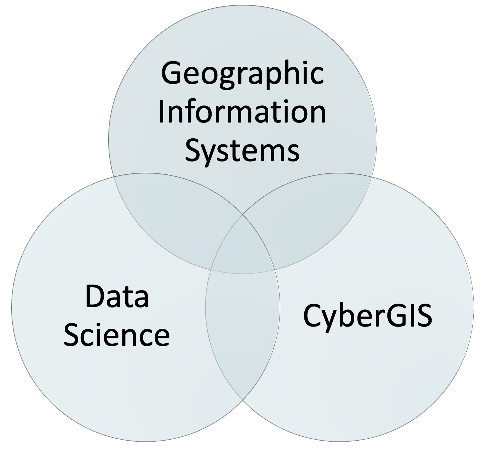{width="60%"}

## Geographic Data Science

- **Analyse** and **extract** insights from geospatial data
- Work with **real-world data** on a number of domains and problems
- Acquire key **data science skills** and important tools to answer spatial questions

<mark>It is in very high demand in industry.</mark>

## *Philosophy* of Geographic Data Science

  Statistician George Box :

*All models are wrong, but some are useful In a similar fashion*.

  Geographer Keith Ord :

*All maps are wrong, but some are useful.*

## In what fields is it useful?

Housing

Transportation

Insurance

Telecommunications

Energy

Retail

Agriculture

Healthcare

Urban planning

And more...

## GIS

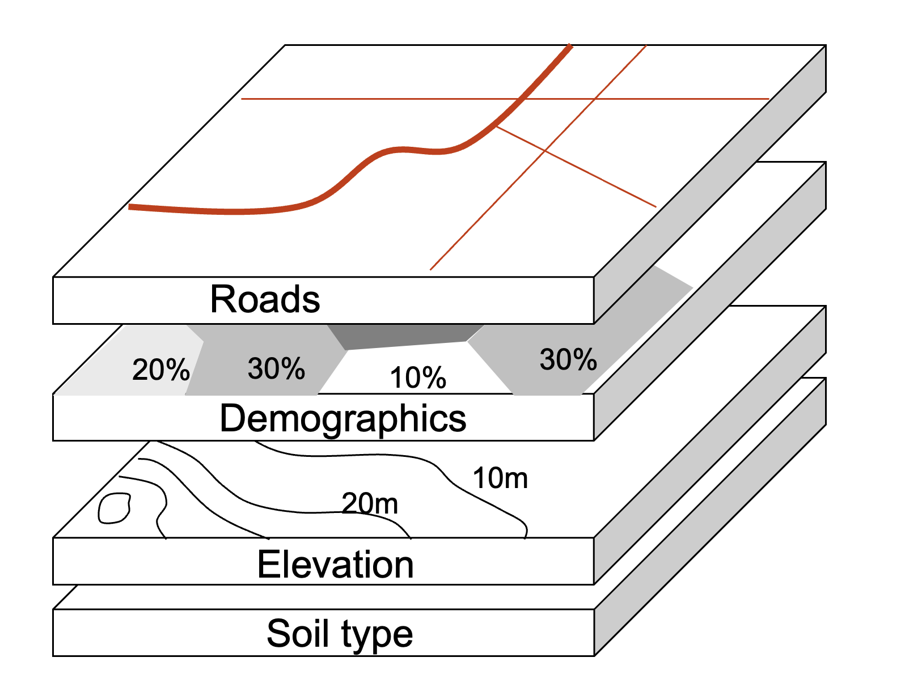

## Layers - Image - Data

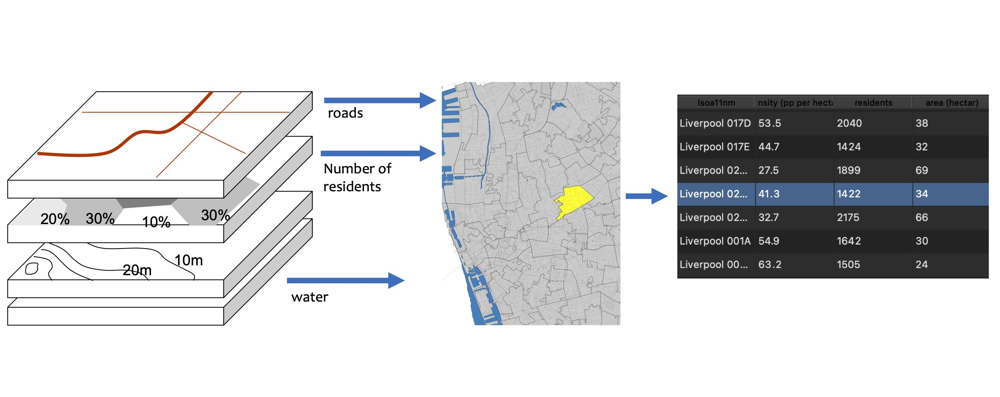

## GIS world vs. Real World

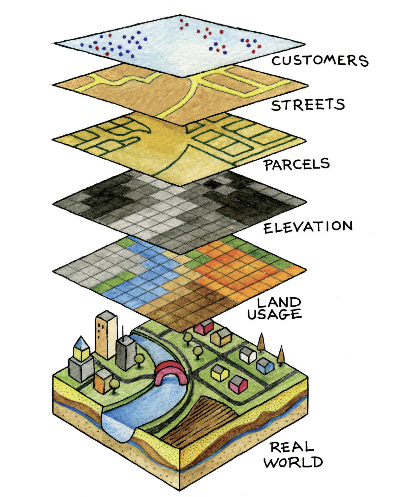

## Skills

::::: columns
::: {.column width="50%"}
**Hard Skills**

- Programming language
- Transparency and reproducibility
- Version control
:::

::: {.column width="50%"}
**Soft Skills**

- Communication
- Storytelling
- Geospatial analytics acumen
- Ethical skills
:::
:::::

# Open Science

## Command line interface

**Graphical User Interfaces (GUIs)**

Open source Geographic Information Systems (GIS), exemplified by software like QGIS, have revolutionized the accessibility of geographic analysis on a global scale. However, they inadvertently introduce a challenge to reproducibility.

**Command Line Interfaces (CLIs)**

Command Line Interfaces (CLIs) offer a solution to the reproducibility challenge in GIS.

## The geodata 'revolution’

**Advanced Hardware**: High-performance computer hardware combined with efficient algorithms are driving the geospatial data revolution, allowing us to process vast datasets quickly.

**Scalable Software**: Scalable software solutions are essential for sifting through this data deluge, helping us extract valuable insights from the noise.

**Spatial Databases**: The advent of spatial databases empowers us to store and manipulate manageable subsets within the vast sea of geographic data.

# Logistics

## Sessions

- Lectures *and* labs
- **Tuesdays 10-11am** (Lecture 1h)
- **Tuesdays 1-3pm** (Lab 2h approx)
- Keep in touch on Teams!

## Canvas

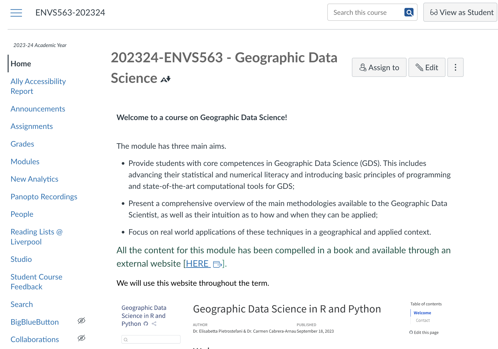

## Website

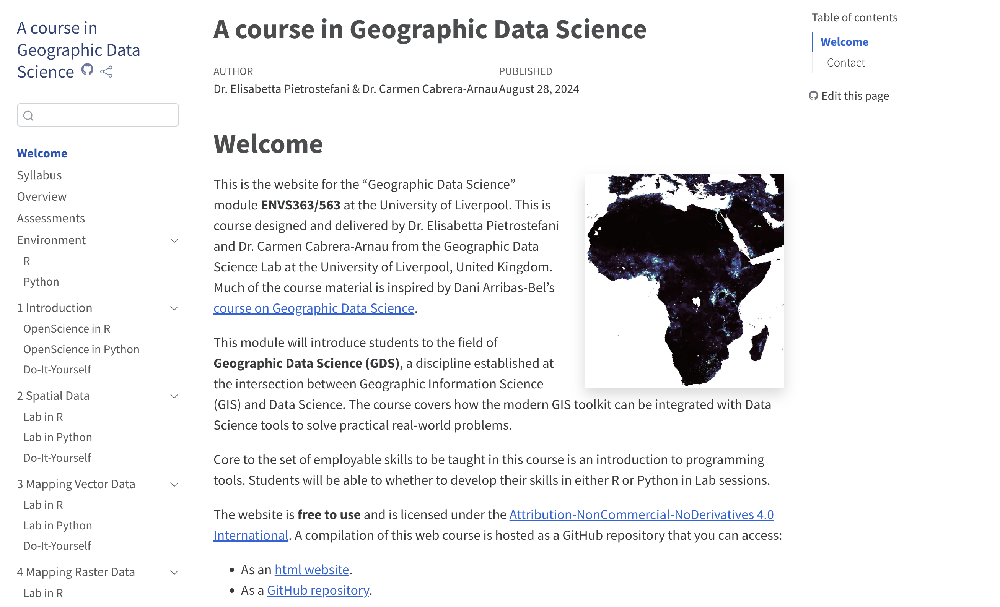

[`https://gdsl-ul.github.io/gds/`](https://gdsl-ul.github.io/gds/teams.png)

## Teams

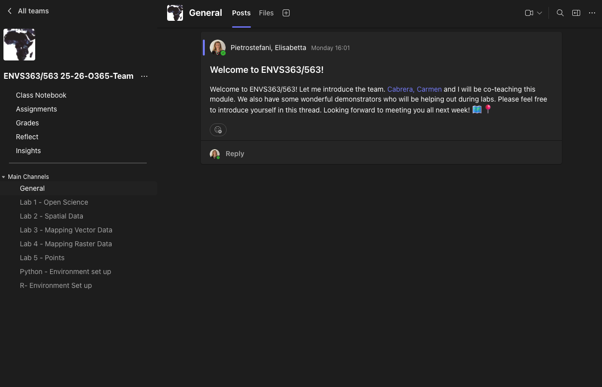

## Code

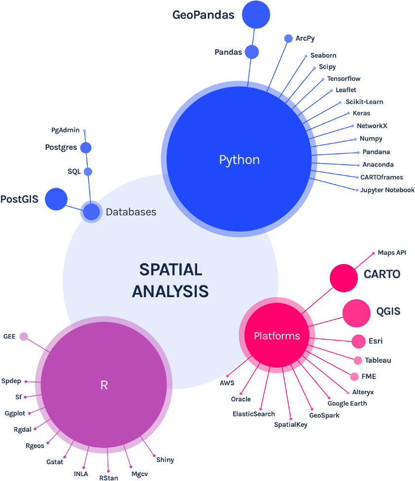

## Code

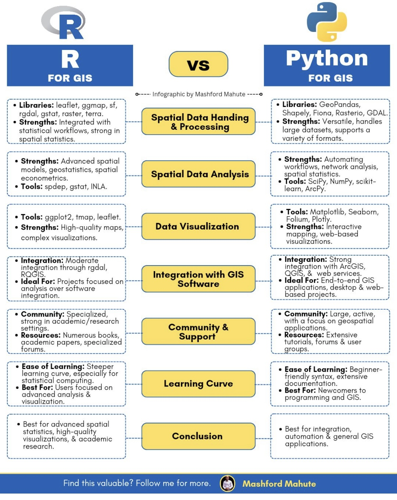

## Code

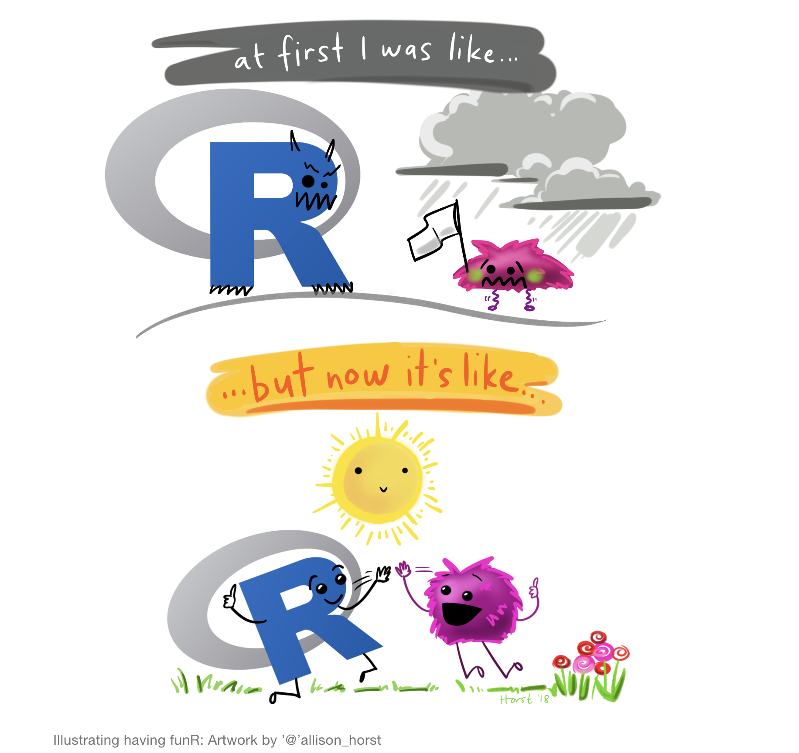

## Code

## Website

- Syllabus
- Assessments
- Environment

<mark> [Let's have a look](https://gdsl-ul.github.io/gds/) </mark>

## Assignments {.smaller}

**Assignment I**

Title: Programmed Map

Due date: 5th November 2026 (week 6)

40% of the final mark

**Assignment II**

Title: Computational Essay

Due date: 10th December 2026 (week 11)

60% of the final mark

 

<mark>Both assignments are **Tier 3** for Generative AI: *exploratory / critical use*</mark>

## Generative AI: both assignments are Tier 3 {background-color="#ffb74d"}

**Tier 3 — Structural scaffold: exploratory / critical use**

::: fragment
Generative AI tools (ChatGPT, Claude, nebulaone.ai...) are broadly **allowed** for **specific stages** or **tasks** in both assignments.
:::

::: fragment
Engage **actively** with AI: **generate, critique, iterate, refine** — to build your **AI literacy**.
:::

::: fragment
AI is **not the primary producer** of your work: if you can't explain or justify it yourself, it's an **Academic Integrity concern**.
:::

## Generative AI — Tier 3 evidence required {background-color="#ffd54f"}

Every submission must include **evidence of how you used AI**, for example:

::: incremental
- **Summary account** of how AI was used: which tool, for which part (narrative/code), and how
- **Key AI interactions**: prompts, outputs, and your edits
- **Critical evaluation** of the AI contributions: what helped, what was wrong or needed changing
- **Cite or attribute** AI use where appropriate
:::

## Generative AI — what to declare {background-color="#ffd54f"}

::: incremental
- **Narrative**: your own words — AI proof-reading that changes wording/structure must be declared
- **Code**: AI support is fine, but you must be able to explain every line
- **Undisclosed use found later = penalty**, not just a missing declaration
:::

::: fragment
<mark>Full declaration form: [gdsl-ul.github.io/gds/ai-declaration.html](https://gdsl-ul.github.io/gds/ai-declaration.html)</mark>
:::

## Do not invent data with AI {.center background-color="#b71c1c"}

## {.center}

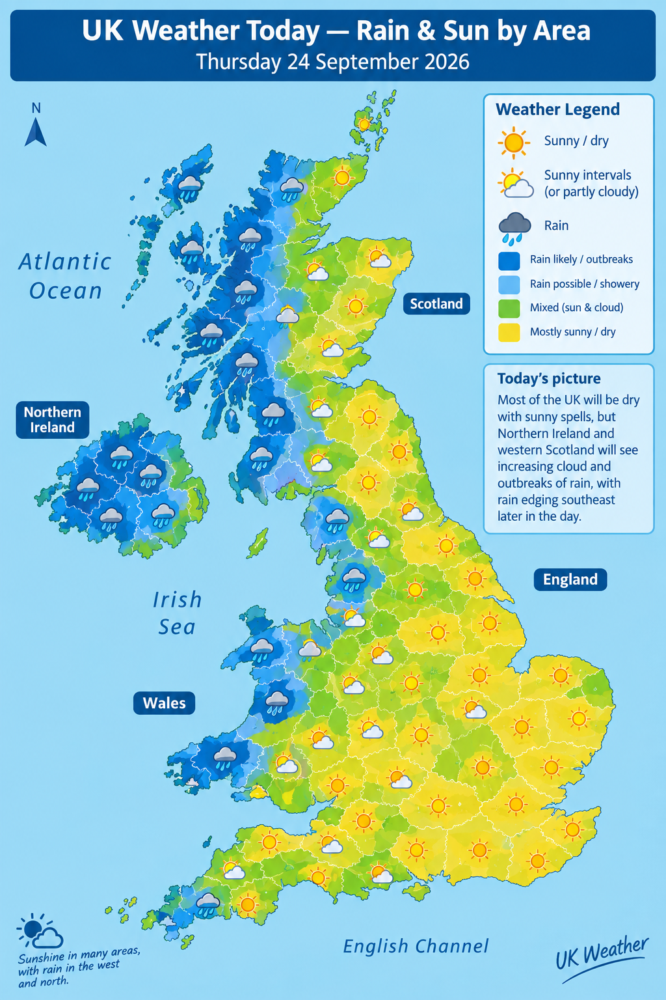
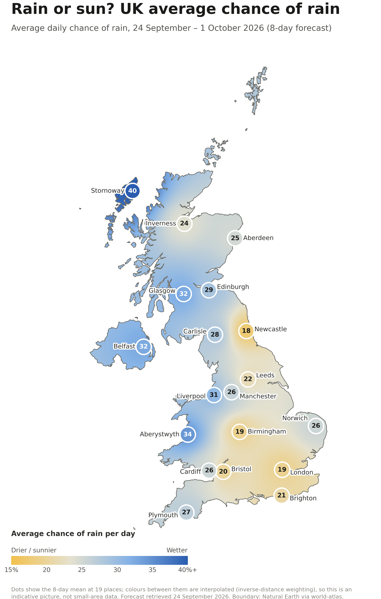
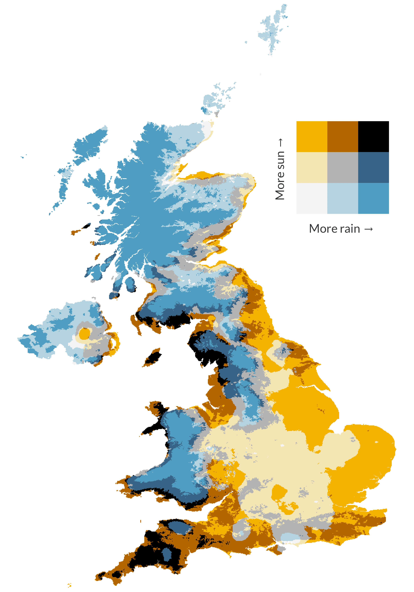
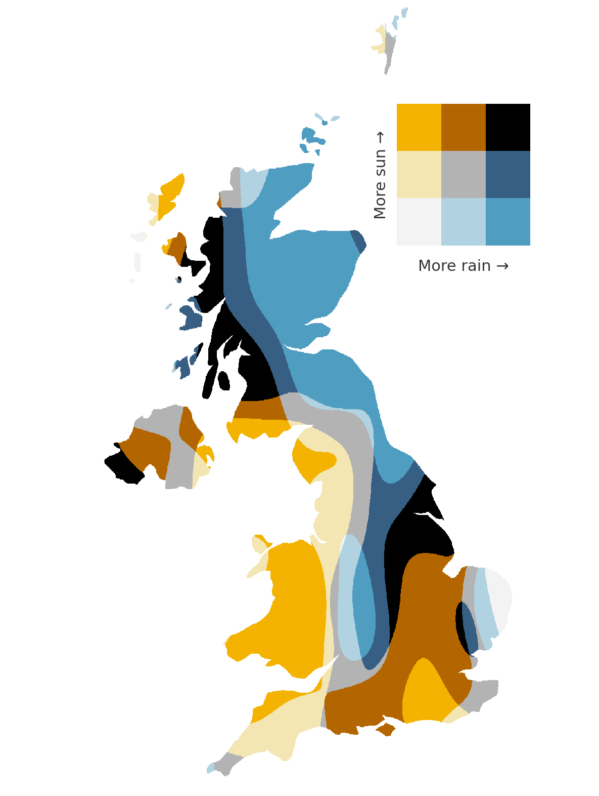

## Which map is not AI-generated

::: incremental
- **Clear question**: a bivariate map comparing total hours of sunshine with total annual rainfall. Black areas have plenty of both.
- **Named, citable data**: from the Met Office ([Hollis et al.](http://dx.doi.org/10.5285/bbca3267dc7d4219af484976734c9527))
- **Documented method**: produced in R
- **Reproducible**: [replication code here](https://github.com/VictimOfMaths/Maps/blob/master/SunVsRain.R)
- **Credited author**: plot by @VictimOfMaths
:::

## Critical thinking: questions to ask of any map {.smaller background-color="#ffd54f"} 

::: incremental
1.  **Where does the data come from?** Is a source named, and can you find it?
2.  **What is measured?** Variable, year, units
3.  **Can you read it?** Is there a legend, and does it match what's on the map?
4.  **Could you reproduce it?** Is there data and code you can re-run?
5.  **Does it pass a sanity check?** Does the pattern match what you already know?
:::
::: fragment
Put your answers in your **Tier 3 evidence**: what AI produced, and how you checked it.
:::

## More Help

This course is much more about *learning to learn* and **problem solving** rather than acquiring specific programming tricks or stats wizardry.

- Learn to ask questions (but don’t expect exact answers all the time!!!)
- <mark>Help others</mark> as much as you can (the best way to learn is to teach)
- Search heavily on <mark>Google + Stack Overflow</mark>, and now <mark>AI tools</mark> too (check what they give you, and declare your use)

## Workflow

come to the **Lectures**

1.  Go over the Concepts sections of each week after the lecture
2.  Have a look at the Readings and/or videos
3.  Record questions and post them on Teams prior to the lab

## Workflow

come to the **Labs**

1.  Come work through the code and DIY sections
2.  Live answers to questions posted
3.  Support from your lecturers and demonstrators

- Hands on!
- Collaborate *and* participate

# Questions

# 

 [Geographic Data Science]{xmlns:dct="http://purl.org/dc/terms/" property="dct:title"} by <a xmlns:cc="http://creativecommons.org/ns#" href="http://pietrostefani.com" property="cc:attributionName" rel="cc:attributionURL">Elisabetta Pietrostefani</a> is licensed under a <a rel="license" href="http://creativecommons.org/licenses/by-sa/4.0/">Creative Commons Attribution-ShareAlike 4.0 International License</a>.
