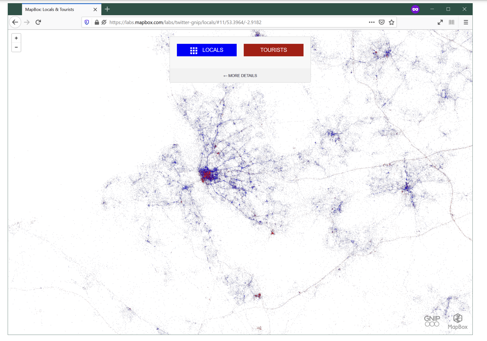
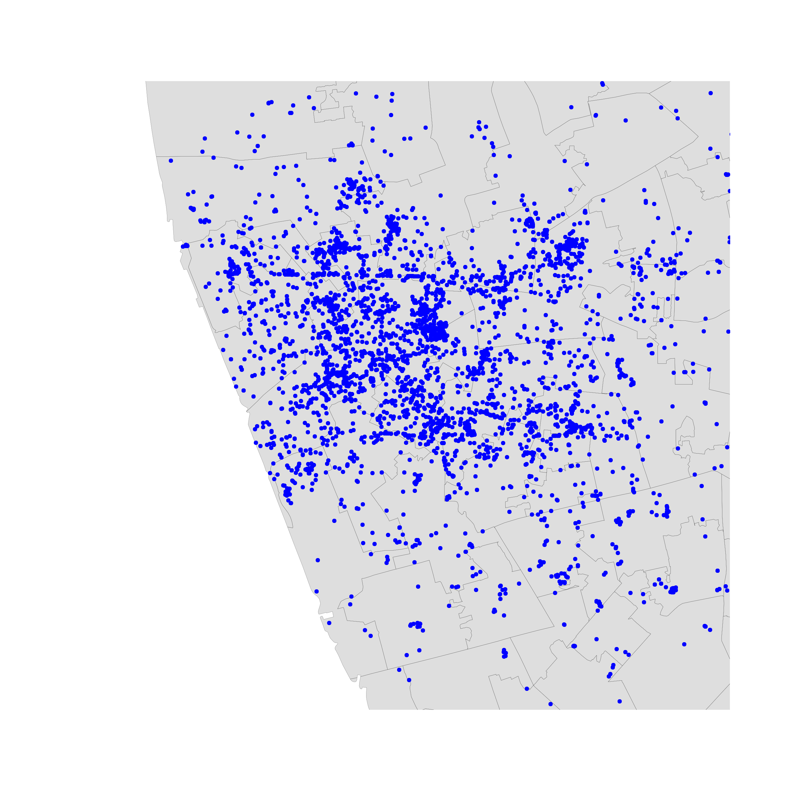
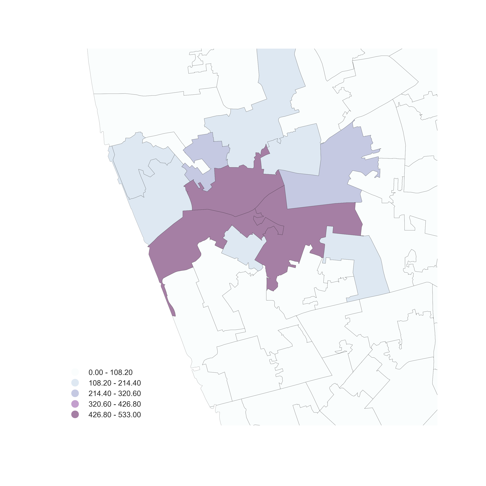
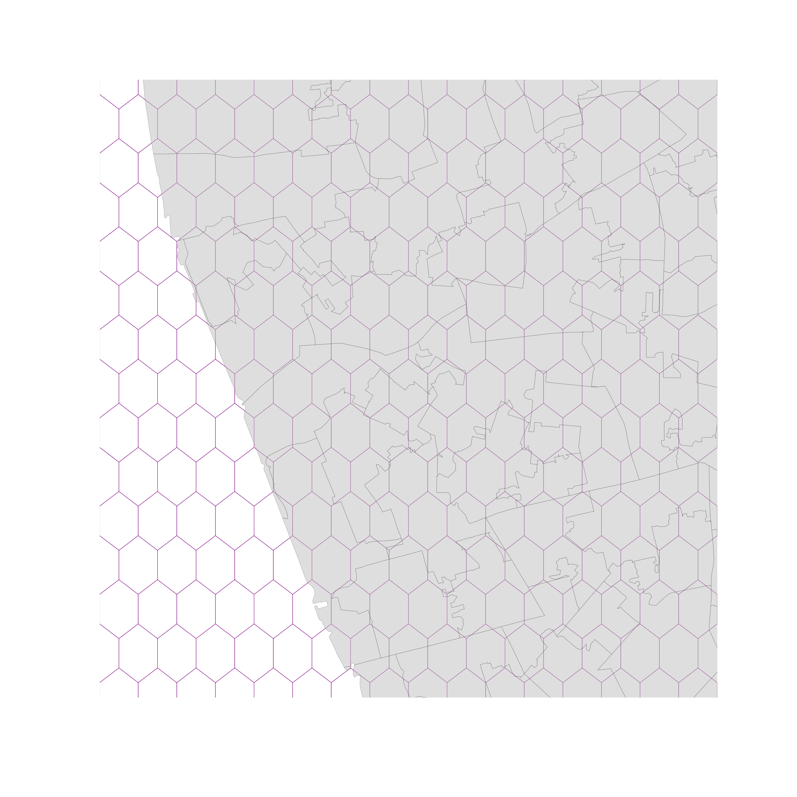
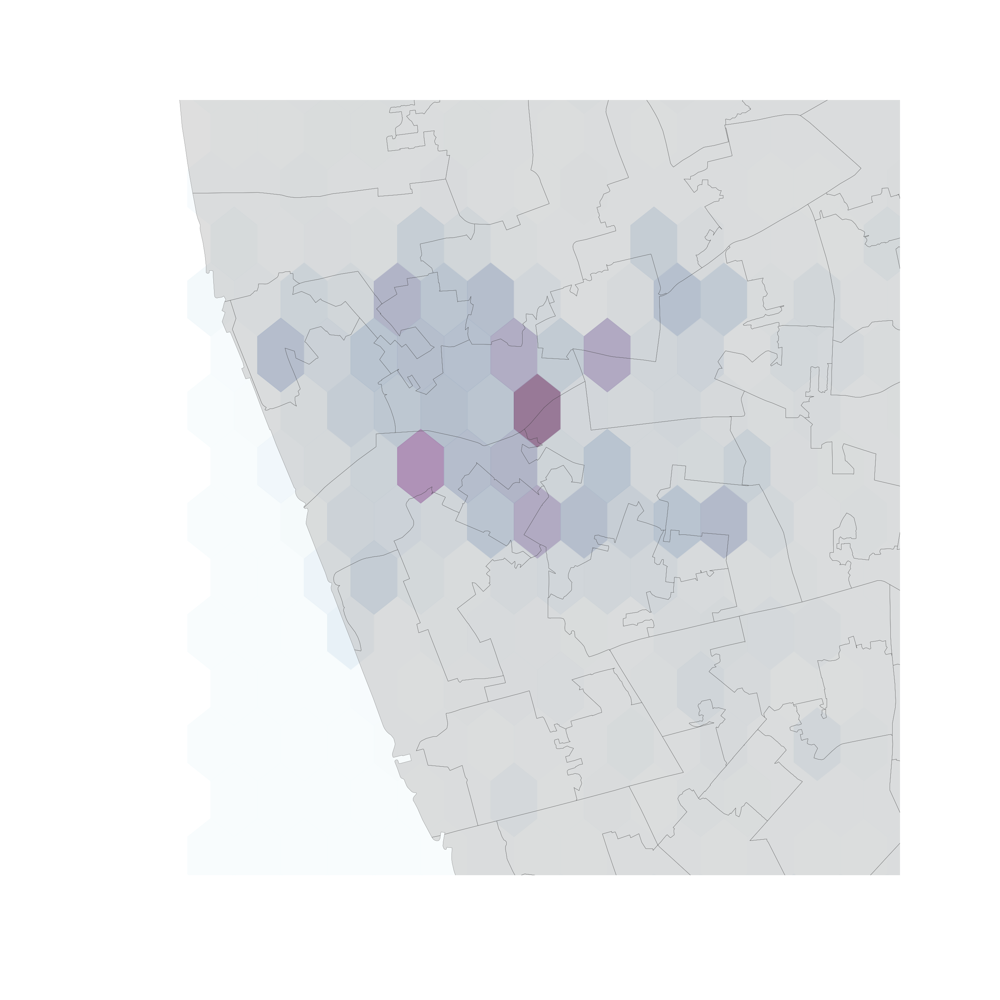
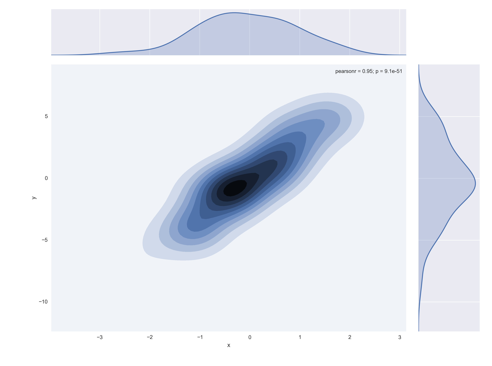
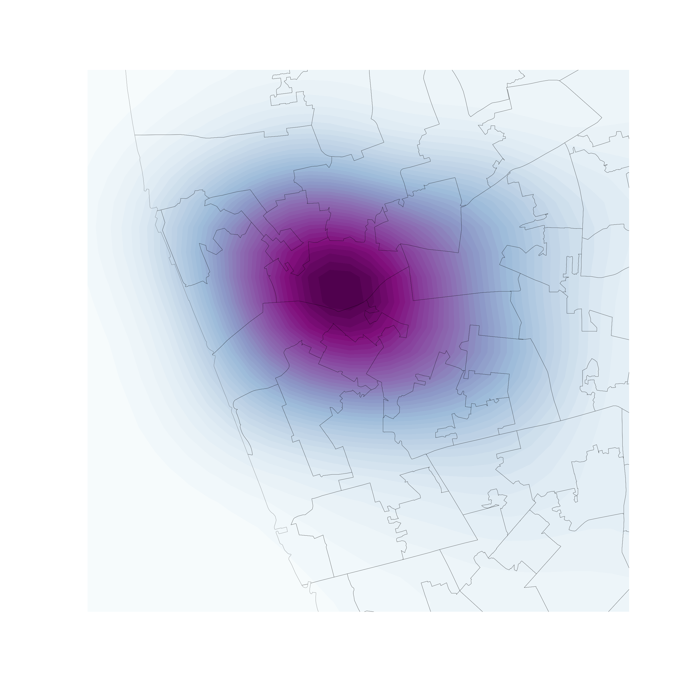
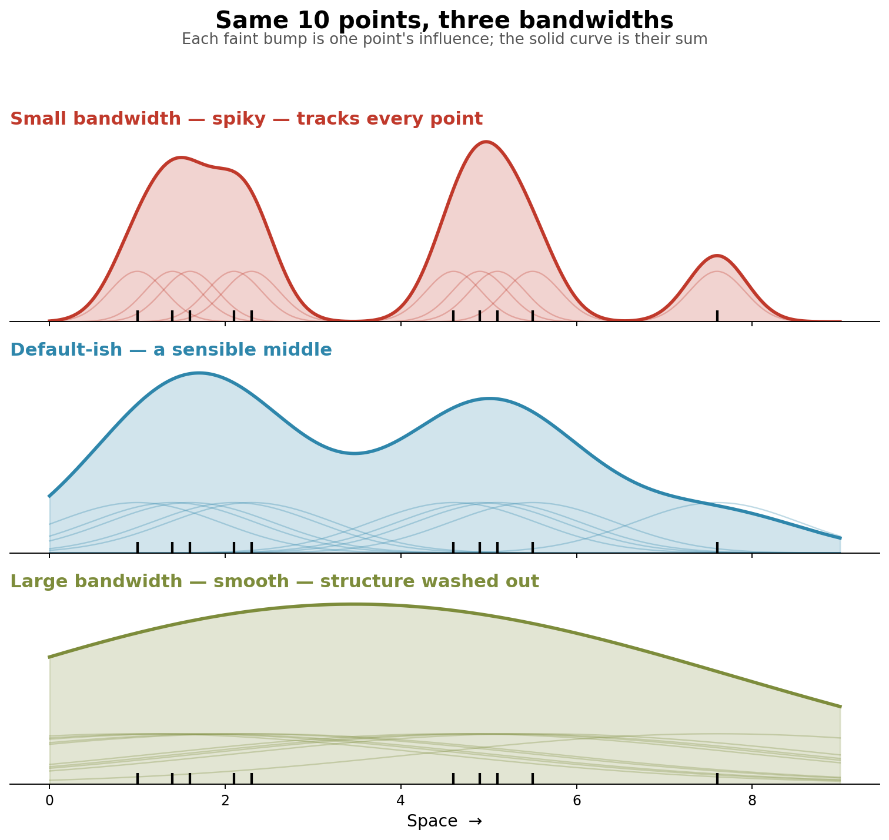
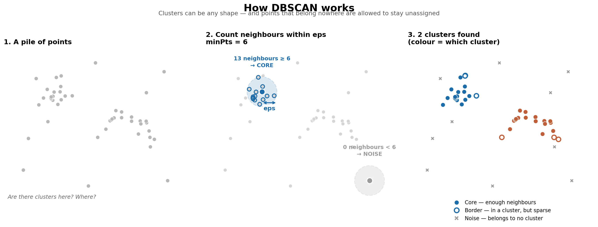

# The *point* of points

# Points like polygons

-   Points *can* represent "fixed" entities
-   In this case, points are qualitatively similar to polygons/lines
-   The goal here is, taking location fixed, to model other aspects of the data

# Points like polygons

Examples: - Cities (in most cases) - Buildings - Polygons represented as their centroid - ...

# When points are not polygons

Point data are not only a different geometry than polygons or lines...   ... Points can also represent a fundamentally different way to approach spatial analysis

# Points unlike polygons

# A few examples

# 

# 

# 

# Point patterns

# Point patterns

Distribution of **points** over a portion of **space** Assumption is a point can happen anywhere on that space, but only happens in specific locations

-   **Unmarked**: locations only
-   **Marked**: values attached to each point

# Point Pattern Analysis

Describe, characterize, and explain point patterns, focusing on their **generating process**

-   Visual exploration
-   Clustering properties and clusters
-   Statistical modeling of the underlying processes

# Visualization of Point Patterns

# Visualization of PPs

Three routes (today):

-   One-to-one mapping -- "Scatter plot"
-   Aggregate -- "Histogram"
-   Smooth -- KDE

::: {style="font-size: 0.8em; opacity: 0.8;"}
You will use all three in the lab, in this order.
:::

# One-to-one

-   Intuitive
-   Effective in small datasets
-   Limited as size increases until useless

# One-to-one

# Aggregation

# Points meet polygons

-   Use polygon boundaries and count points per area \[Insert your skills for choropleth mapping here!!!\]
-   But, the polygons need to *"make sense"* (their delineation needs to relate to the point generating process)

# 

   

# Hex-binning

If no polygon boundary seems like a good candidate for aggregation... ...draw a hexagonal (or squared) tesselation!!!

Hexagons...

-   Are regular
-   Exhaust the space (Unlike circles)
-   Have many sides (minimize boundary problems)

# 

       

# But

-   (Arbitrary) aggregation may induce MAUP 
-   Points usually represent events that affect only part of the population and hence are best considered as rates

# Kernel Density Estimation (KDE)

# KDE

Estimate the **(continuous)** observed distribution of a variable

-   Probability of finding an observation at a given point
-   "Continuous histogram"
-   Solves (much of) the MAUP problem, but not the underlying population issue

# Bivariate (spatial) KDE

Probability of finding observations at a given point in space

-   **Bivariate** version: distribution of pairs of values
-   In **space**: values are coordinates (XY), locations
-   Continuous "version" of a choropleth

# 

# 

   

# Bandwidth: the one knob that matters

How far does each point's influence spread?

-   **Small bandwidth** → spiky surface, tracks individual points   Lots of detail, lots of noise
-   **Large bandwidth** → smooth blob   Clean, but real local structure washed out

::: {.fragment}
There is **no single correct value**. It's a judgement call about what *scale* of pattern you want to show.
:::

# 

# Bandwidth in the lab

You'll map the same data at three bandwidths and decide which one you'd actually publish

| | R | Python |
|---|---|---|
| Default | *(no argument)* | *(no argument)* |
| Spikier | `adjust = 0.5` | `bw_adjust = 0.5` |
| Smoother | `adjust = 2` | `bw_adjust = 2` |

# Density-Based Spatial Clustering of Applications with Noise, or DBSCAN

# What DBSCAN does

Finds **concentrations of points** — areas denser than the space around them

::: {.fragment}
Unlike the clustering you met earlier in the course, DBSCAN:

-   Finds clusters of **arbitrary shape** (not just blobs)
-   Explicitly labels some points as **noise** — not everything has to belong somewhere
:::

# Three kinds of point

Every point ends up in one of three categories:

-   **Core** — has at least `m` points within distance `r` of it
-   **Border** — inside a cluster, but with fewer than `m` neighbours
-   **Noise** — outside any cluster

::: {.fragment}
That third category is the "N" in DBSCA**N**, and it's what makes the algorithm robust to outliers.
:::

# Two parameters, set by *you*

-   **`eps` (r)** — the search radius. *How close is close?*
-   **`minPts` / `min_samples` (m)** — how many neighbours are needed. *How dense is dense?*

::: {.fragment}
⚠️ Both must be chosen **before** running the algorithm, and both change the answer substantially.
:::

# 

# `eps` is a real distance

::: {.fragment}
This means your data **must be projected** before you run DBSCAN.

-   Lon/lat degrees are not a distance — 1° means something different at the equator than in Buenos Aires
-   In the lab we reproject to **EPSG:22176** (metres, Argentina) first
-   Then `eps = 100` genuinely means *100 metres*
:::

# Parameters change everything

In the lab you'll run the same data twice:

| | Run 1 | Run 2 |
|---|---|---|
| `eps` | 100 m | 250 m |
| min points | 50 | 10 |

::: {.fragment}
Same data, same algorithm, **very** different maps. Compare them and ask which one you'd trust.
:::

# Choosing `eps` less arbitrarily

For every point, measure the distance to its *k*th nearest neighbour, sort those distances, and plot them

::: {.fragment}
-   Look for the **"knee"** — where the curve bends sharply upward
-   Below the knee: points close enough to plausibly cluster
-   Above it: points that look more like noise
-   That knee is a defensible choice of `eps`
:::

# Two advantages worth knowing

::: {.fragment}
**1. It is not necessarily spatial.** Designed for data mining, not geography. Works in 2 dimensions (XY) or many more (price, product type...).
:::

::: {.fragment}
**2. Fast and scalable.** Runs on large datasets without trouble — unlike traditional point pattern methods that lean on simulation. You can iterate quickly.
:::

# Two drawbacks worth knowing

::: {.fragment}
**1. No probabilistic model.** Unlike LISAs, there's no null hypothesis, no inference, no statistical significance. You can't tell whether a "cluster" could have arisen at random.
:::

::: {.fragment}
**2. Agnostic about process.** It tells you *where* the clusters are, not *why* they're there.
:::

# Going further

Plain DBSCAN uses **one fixed radius everywhere** — a problem when some parts of your map are inherently denser than others.

::: {.fragment}
Both labs end with a more robust variant:

-   **R** → `hdbscan()` — works out an appropriate radius per region
-   **Python** → `ADBSCAN()` — runs DBSCAN many times and lets the runs *vote*
:::

::: {.fragment}
::: {style="font-size: 0.8em; opacity: 0.8;"}
Different algorithms, same motivation: handle clusters of varying density.
:::
:::

# In the lab

Buenos Aires Airbnb listings, start to finish:

1.  **One-to-one** — plot every listing
2.  **Aggregate** — count by neighbourhood, then hex-bin
3.  **Smooth** — KDE, and vary the bandwidth
4.  **Cluster** — DBSCAN at two parameter settings, then a robust variant

# R and Python, side by side {.smaller}

| Task | R | Python |
|---|---|---|
| Pull out coordinates | `st_coordinates()` | `.geometry.x` / `.geometry.y` |
| KDE | `geom_density_2d_filled()` | `sns.kdeplot(fill=True)` |
| Adjust bandwidth | `adjust =` | `bw_adjust =` |
| Clustering | `dbscan::dbscan()` | `DBSCAN()` |
| Find optimal `eps` | `kNNdistplot()` | `NearestNeighbors()` |
| Robust variant | `hdbscan()` | `ADBSCAN()` |

# One last thing

::: {.fragment}
Every map you make in the lab is a **working map**, not a finished one.
:::

::: {.fragment}
Raw legend labels, no scale bar, no north arrow, debugging titles...
:::

::: {.fragment}

<mark>Before anything goes in your assignment, clean it up properly.</mark>

:::

# Questions

# 

 [Geographic Data Science]{xmlns:dct="http://purl.org/dc/terms/" property="dct:title"} by <a xmlns:cc="http://creativecommons.org/ns#" href="http://pietrostefani.com" property="cc:attributionName" rel="cc:attributionURL">Elisabetta Pietrostefani</a> is licensed under a <a rel="license" href="http://creativecommons.org/licenses/by-sa/4.0/">Creative Commons Attribution-ShareAlike 4.0 International License</a>.
