# Raster Data

## 

 

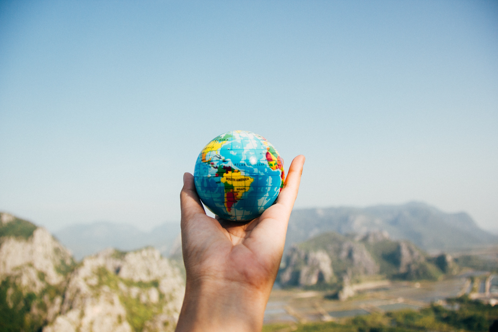

## 

 

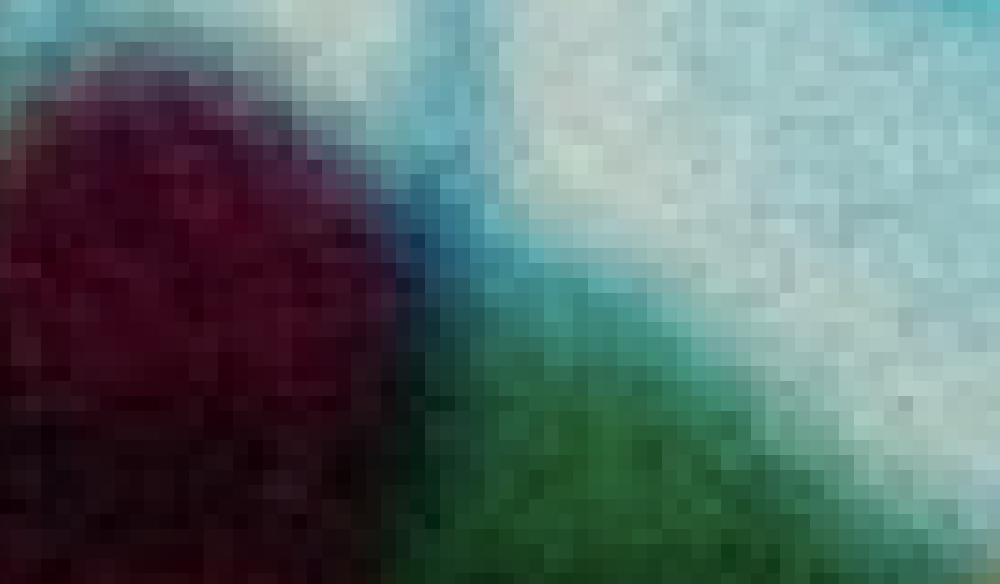

## 

 

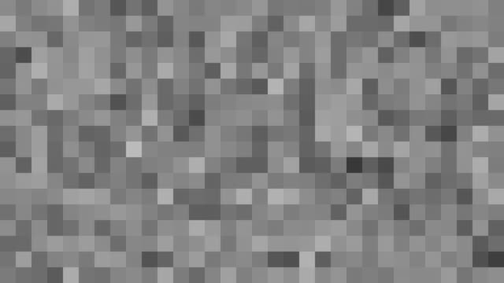

## Vector Data

 

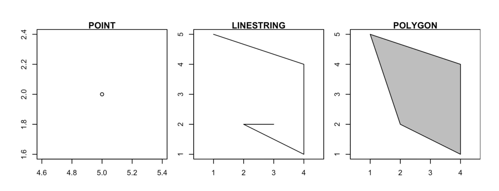

## Contrast with Vector Data

 

   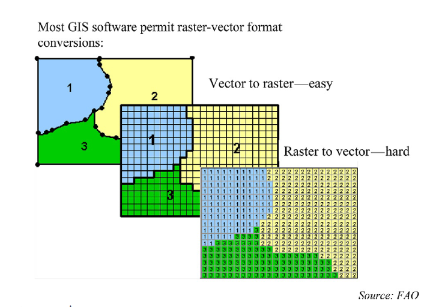

## Definition

- Square grid of pixels. Pixel values can represent continuous or categorical variables:
- Divides 2-D space into regular cells - pixels
- Each cell has a single value
- Values assigned according to value at mean, centre point, or some other rule

## File Formats

   

      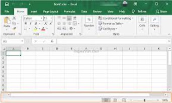    

# Raster Data Types

## Grayscale Rasters

Continuous Data, Single Band

## Nightlights data

- Nightlights data can be represented as a grayscale raster, where darker areas indicate lower levels of artificial light, and lighter areas represent higher levels of artificial light.
- The pixel values may represent the radiance or luminance values of nighttime lights.
- Used for monitoring urban development, assessing light pollution, and understanding human activity patterns at night...

## Multispectral Rasters

Multiple Bands

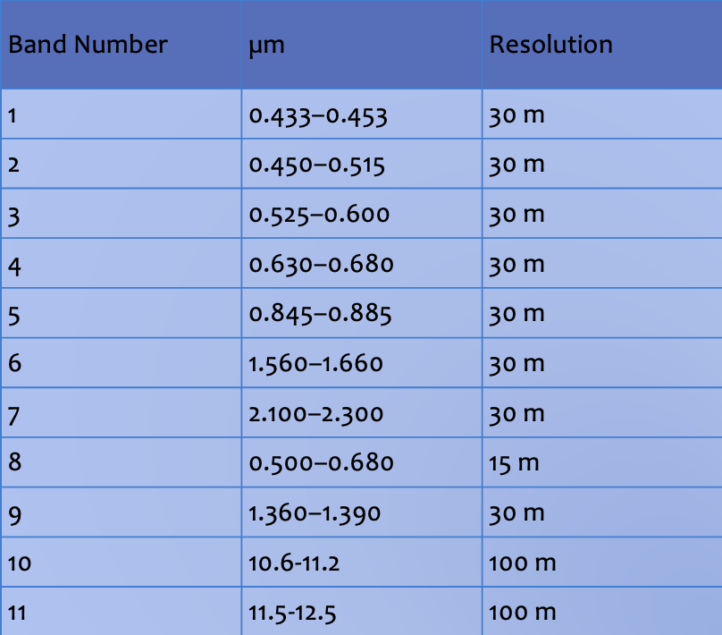

## Bands 2, 3 and 4

Blue, green, and red for true-color image.

 

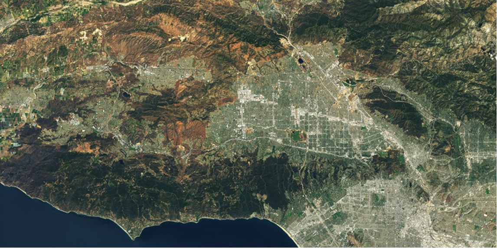

## Landsat Satellite Imagery

- Landsat satellites capture data in multiple spectral bands, such as visible, near-infrared, and thermal infrared.
- Each band is represented as a separate channel in a multispectral raster, allowing for the analysis of various aspects of the Earth's surface.
- Different bands capture information related to vegetation, water, and land use.

## Sources {.smaller}

- High spatial resolution data - costly commercial products.
- Lower spatial resolution data is free (NASA, ESA, etc).
- Several sources:
  - [USGS Earth Explorer](https://earthexplorer.usgs.gov/) — Landsat, and much else
  - [NASA Earthdata Search](https://search.earthdata.nasa.gov/search)
  - [AppEEARS](https://appeears.earthdatacloud.nasa.gov/) — extract by area, no bulk download
  - [LP DAAC Data Pool](https://lpdaac.usgs.gov/)
  - [Copernicus Data Space](https://dataspace.copernicus.eu/) — Sentinel (replaced the old SciHub)
  - [Landsat on AWS](https://aws.amazon.com/marketplace/pp/prodview-ivr4jeq6flk7u)

::: {style="font-size: 0.8em; opacity: 0.75;"}
Several of these need a free account, and all involve downloading large files.
:::

## Color Rasters

Digital Photography, Optical Satellites

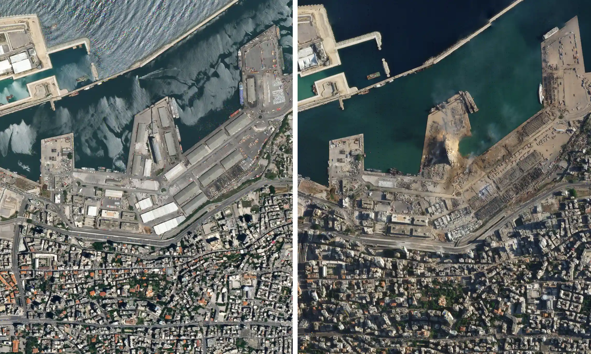

## Color Rasters

- Digital photographs are typically stored as color rasters, combining red, green, and blue (RGB) channels to represent a full range of colors.
- Each pixel's RGB values determine the color in the image.
- Digital cameras and most image-editing software work with RGB color rasters.

## Elevation Rasters

Representing Terrain Data

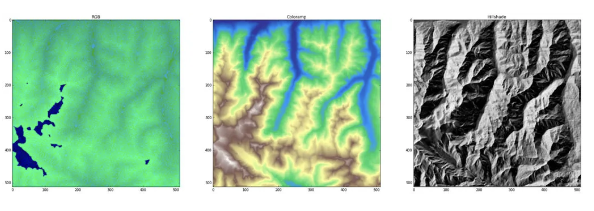

Left: *raw RGB*, Center: *decoded to hypsometric tint*, Right: *decoded to hillshades*

</right>[Mapbox](https://blog.mapbox.com/global-elevation-data-6689f1d0ba65)</right>

## Digital Elevation Models (DEMs)

- Digital Elevation Models are used to represent terrain data.
- DEMs are rasters where each pixel's value represents the elevation (height) of the corresponding location on the Earth's surface.
- These rasters are widely used in geospatial applications, including topographic mapping and hydrological modeling.

# Resolution

## Spatial Resolution

- Level of detail or granularity in the spatial domain of data.
- How well an instrument or sensor can distinguish between objects or features in a given space.
- <mark>Higher</mark> spatial resolution = more <mark>detailed</mark> data
- <mark>Larger file sizes</mark> and <mark>Increased data processing</mark> demands.

## Temporal Resolution

- Accuracy and precision of time measurements
- The higher the temporal resolution, the more frequent and precise the time measurements, allowing for the tracking of fast-changing processes or events.

## Data Volume and Storage

- Unprecedented rate of collection.
- Fundamental aspects of data management.
- Challenges associated with handling and storing vast amounts of dat
- Traditional hardware-based solutions vs cloud-based storage (right approach?)

# Future Trends

## Big Data and Raster Information

- Transforming the way we handle geospatial data.
- Sensors and technology become more sophisticated
- The volume of raster information is growing exponentially.

## Machine Learning and Raster Data {.smaller}

- Chen Wangyang, Wu, Abraham Noah, Biljecki and Filip, 2021. Classification of Urban Morphology with Deep Learning: Application on Urban Vitality. *Computers, Environment and Urban Systems*

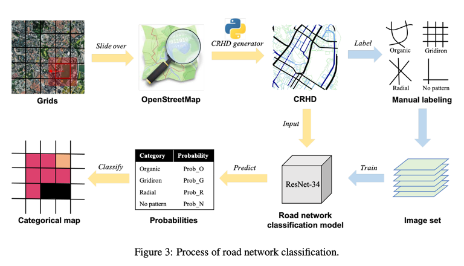

## Cloud-Based Raster Data Services

- Redefining how we store, process, and share raster data.

- The cloud offers scalability, accessibility, and cost-efficiency that traditional on-premises systems can't match.

# Satellite data for Social Science

## Henderson et al 2012.

"Measuring economic growth from outer space", AER.

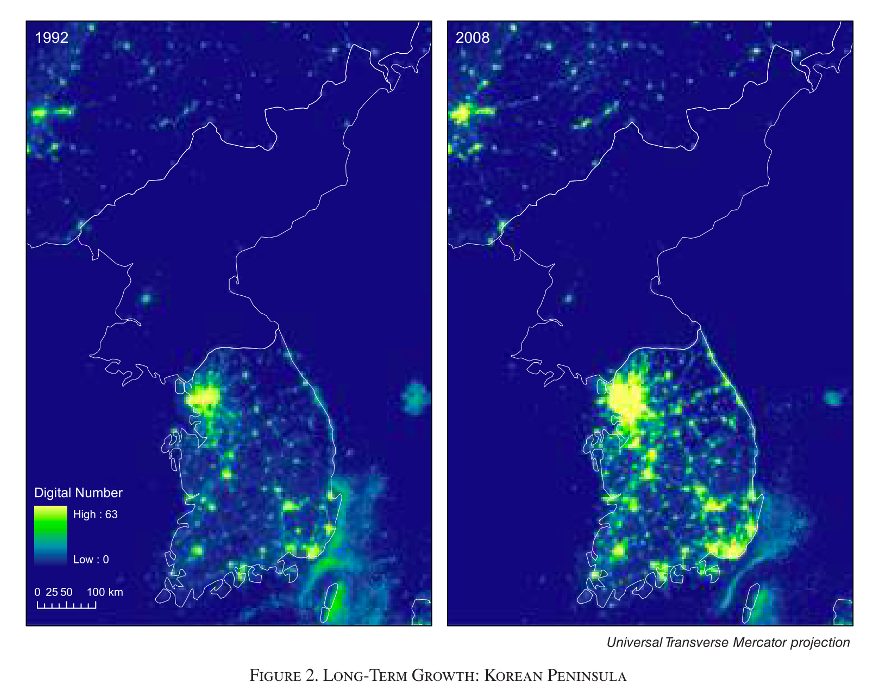

## Jean et al. 2016.

"Combining satellite imagery and machine learning to predict poverty." Science

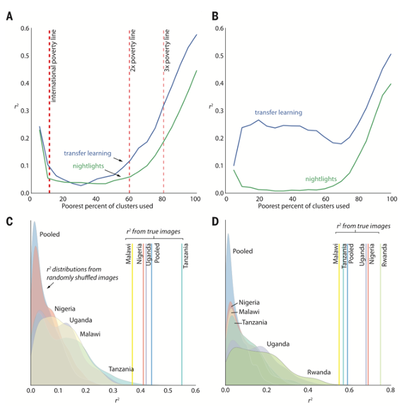

# From pixels to policy

## The problem with raw imagery

Everything on the last few slides sounds great — but working with raw satellite data is *hard*

::: incremental
- A single Sentinel-2 scene is **several gigabytes**
- Half your pixels are hidden under **cloud**
- Cleaning, mosaicking and modelling needs real compute
- And pixels don't line up with the units social science actually uses — LSOAs, wards, local authorities
:::

## The four steps

Turning a noisy grid of numbers into something usable:

::: incremental
1.  **Raw** — spectral values, noisy, partly cloud-covered
2.  **Clean** — combine many passes to remove cloud
3.  **Model** — convert spectral values into a meaningful indicator (temperature, vegetation, cloud probability)
4.  **Aggregate** — pool pixels into administrative units
:::

::: fragment

<mark>Step 4 is where raster becomes choropleth</mark>

:::

## This is what Imago does

[**Imago**](https://imago.ac.uk) is the imagery data service for sustainability, prosperity and wellbeing — part of Smart Data Research UK, based partly here at Liverpool

::: fragment
They do steps 1–4 for you and publish the result:

- Ready-to-use **LSOA/MSOA-level** statistics
- No gigabyte downloads, no remote-sensing algorithms
- Small-area detail preserved, not regional averages
:::

## You've already used this

::: fragment
The **SPF (Sun Probability Framework)** data you mapped in the choropleths lab?   That's satellite-derived cloud probability, aggregated to small areas.
:::

::: fragment

<mark>You were doing raster analysis without touching a raster</mark>

:::

:::: fragment
::: {style="font-size: 0.85em;"}
Which is the point — someone still has to do the pixel work. This week, that's you.
:::
::::

## Go deeper {.smaller}

::::: {style="display:flex; align-items:center; justify-content:center; gap:2.5rem; margin-top:1rem;"}
::: {style="max-width:52%; text-align:left;"}
<b>Imago training</b> — free, open, in R and Python. Air temperature, precipitation, SPF. Several run in your browser, no install.    <a href="https://imago-sdruk.github.io/Imago_training/">imago-sdruk.github.io/Imago_training</a>
:::

::: {}
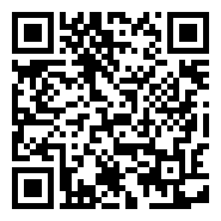
:::
:::::

## From grids to areas {.smaller}

::::: {style="display:flex; align-items:center; justify-content:center; gap:2.5rem; margin-top:1rem;"}
::: {style="max-width:52%; text-align:left;"}
The full walkthrough of everything on the last few slides — spectral bands, resolution, revisit cycles, and the raw → clean → model → aggregate pipeline.    <a href="https://imago-sdruk.github.io/Imago_training/satellites_to_areas.html">Imago: From grids to areas</a>
:::

::: {}
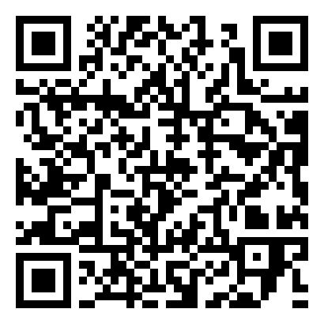
:::
:::::

# In the lab

## What you'll do {.smaller}

**Terrain — Lebanon**

- Load a DEM, check its CRS, reproject it
- **Crop** then **mask** to the country boundary
- Style it properly (breaks, elevation palettes)
- **Extract** raster values to survey points — the raster→vector bridge

::: fragment
**Night lights — Kenya & Tanzania**

- Stack multi-year rasters
- **Zonal statistics**: mean light per administrative region
- Map 1992 vs 2013 — and find the story in it
:::

## Two things to watch for

::: fragment
**1. CRS mismatches.** The single most common reason raster code silently returns `NA`. Check before you extract, not after.
:::

::: fragment
**2. Crop *then* mask.** Both narrow a raster to your area of interest, but cropping first is much faster on large files.
:::

# Questions

# 

 [Geographic Data Science]{xmlns:dct="http://purl.org/dc/terms/" property="dct:title"} by <a xmlns:cc="http://creativecommons.org/ns#" href="http://pietrostefani.com" property="cc:attributionName" rel="cc:attributionURL">Elisabetta Pietrostefani</a> is licensed under a <a rel="license" href="http://creativecommons.org/licenses/by-sa/4.0/">Creative Commons Attribution-ShareAlike 4.0 International License</a>.
