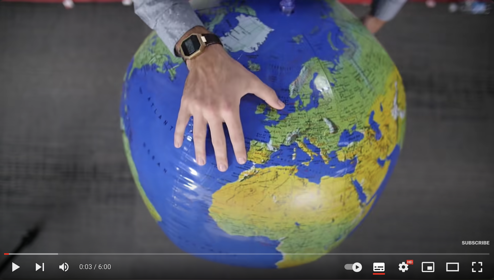
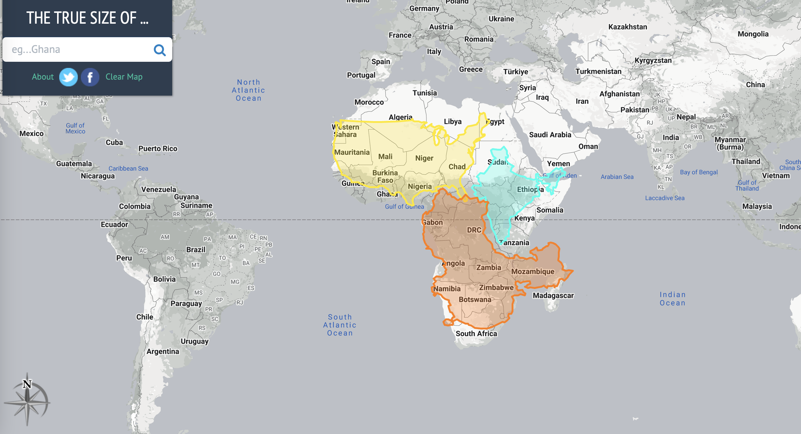
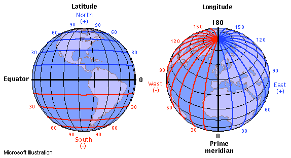
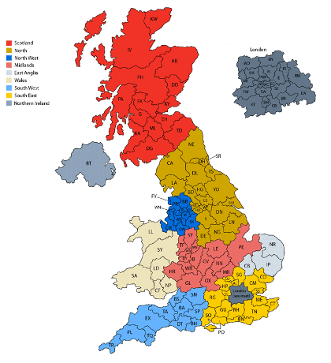
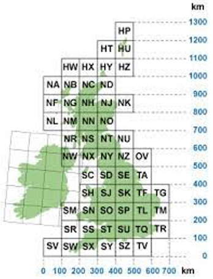
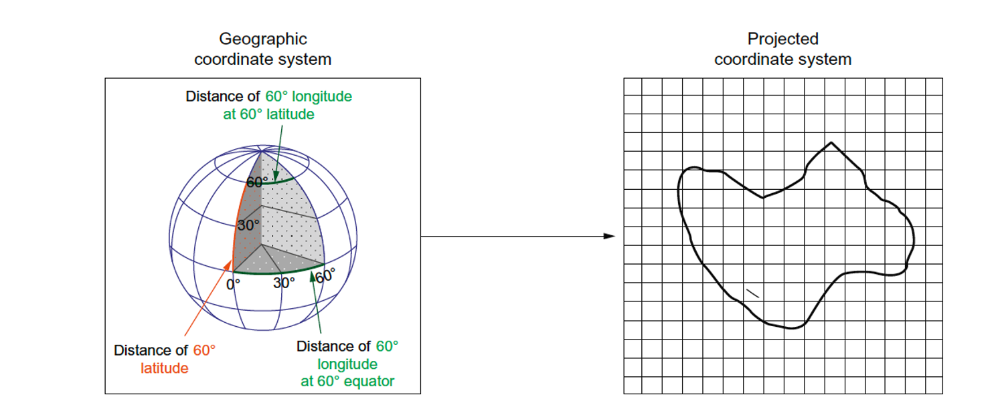

# Data, data, data

-   Everything produces data
-   New dense quantitative representations of the world
-   But data is not useful, insights are

## Data Science

"gathering data messaging it into a tractable form, making it tell its story and presenting that story to others"

 

Loukides (2011) What is Data Science?

## Spatial Data Science

-   A lot of new data is spatial data
-   Spatial is special
-   We don't want to reinvent the GIS wheel
-   How do we bring both world together?

# *Good old* spatial data (+)

## *Good old* spatial data (+)

Traditionally, datasets used in social sciences are

- Collected for the purpose (carefully designed)
- Detailed and informative ("rich profile and portraits of the country") 
- High quality

## *Good old* spatial data (-)

But also 

- Massive enterprises (very costly) 
- Coarse in resolution (to preserve privacy they need to be aggregated) 
- Slow - the more detailed, the less frequent they are available

## Examples

-   Decennial census (census geographies)
-   Longitudinal surveys
-   Custom collected surveys, interviews etc.
-   Economic or well-being indicators

# *New Forms* of spatial data

## *New Forms* of spatial data

Tied into the geo-data revolution

-   Accidental : created for different purposes but available for analysis as a side effect

-   Very diverse in nature: resolution and quality but, potentially much more detailed in both space and time

 

<mark> We will look at this more in a few weeks! </mark>

## Lazer & Radford (2017)

-   <mark>Digital life</mark>: digital actions (Twitter, Facebook, WikiPedia...)

-   <mark>Digital traces</mark>: record of digital actions (CDRs, metadata...)

-   <mark>Digitalised life</mark>: nonintrinsically digital life in digital form (Government records, web...)

## Arribas-Bel (2014)

Three levels, based on how they originate:

-   <mark>Bottom up</mark>: "Citizens as sensors"

-   <mark>Intermediate</mark>: Digital businesses/businesses going digital

-   <mark>Top down</mark>: Open Government Data

## Opportunities (Lazer & Radford, 2017)

- Massive, passive 
- Nowcasting 
- Data on social systems 
- Natural and field experiments ("always-on" observatory of human behaviour)
- Making big data small

## Challenges (Arribas-Bel, 2014)

- Bias 
- Technical barriers 
- Methodological "mismatch"

# All maps are wrong

## All maps are wrong

Tell your neighbour how maps can lie. 

## All maps are wrong

## Still not convinced? {.smaller}

Scan to play with [thetruesize.com](https://thetruesize.com/) — drag any country around the globe and watch its true size change.

{width="220px" fig-align="center"}

## Breaking: *Correcting* the map {background-color="#1B2A4A" style="color:white;"}

On **4 September 2026**, the UN General Assembly voted **164–1** (6 abstentions) to adopt "Correct the Map" — encouraging a shift from Mercator to the **Equal Earth** projection.

::: {.fragment}
Non-binding. Doesn't ban Mercator for navigation. Doesn't redraw a single border.
:::

::: {style="font-size: 0.6em; opacity: 0.75;"}
UN News · The Guardian · Al Jazeera · CBC · also widely reported by the BBC
:::

## Not everyone agreed

164 in favour, **1 against** (the United States), 6 abstentions.

::: {.fragment}
US representative: the resolution is *"the reason this institution is losing its credibility"* — the Assembly shouldn't be *"debating map projects from the 16th century."*
:::

::: {.fragment}
Togo's FM Robert Dussey: maps shape *"education, imagination and collective perception."*
:::

## Why it matters

<mark>On Mercator: Greenland ≈ Africa in size</mark>

 

In reality, Africa is about **14× larger** than Greenland.

::: fragment
Mercator is **conformal** (preserves shape/angle) → area gets distorted, worse toward the poles.

Equal Earth is **equal-area** (preserves area) → shape gets distorted instead.
:::

## The EPSG codes {.smaller}

*(the news coverage never mentions them — here's the definitive list)*

| CRS | EPSG |
|----|----|
| Equal Earth (projection method) | 1078 |
| WGS 84 / Equal Earth **Greenwich** | **8857** |
| WGS 84 / Equal Earth Americas | 8858 |
| WGS 84 / Equal Earth Asia-Pacific | 8859 |
| World Mercator | 3395 |
| Web Mercator (Google Maps, OSM) | 3857 |

## Try it yourself

<mark>[Al Jazeera: guess the real size of each country](https://interactive.aljazeera.com/aje/2026/new-world-map/indexmap.html)</mark>

Pick which country is bigger, watch it morph from Mercator to Equal Earth, see how close you were.

{width="220px" fig-align="center"}

##  Linking Spatial Info

  

 &nbsp;&nbsp;&nbsp;&nbsp;&nbsp;&nbsp;&nbsp;&nbsp;&nbsp;&nbsp;

## Linking Spatial Info

##  Coordinate Reference Systems
Coordinate reference systems provide the context of coordinates:

-   They tell whether the coordinates are <mark>ellipsoidal (angles)</mark>, or derived, <mark>projected (Cartesian)</mark> coordinates
-   In case they are projected, they detail the kind of projection used, so that the underlying ellipsoidal coordinates can be recovered

##  Coordinate Reference Systems

-   Convert between projected and unprojected, or to another projection
-   Transform from one datum to another
-   Combine the coordinates with any other coordinates that have a coordinate reference system

# Have a better look at the concepts page

{width="220px" fig-align="center"}

[`gdsl-ul.github.io/gds/spatialdata.html`](https://gdsl-ul.github.io/gds/spatialdata.html)

# Questions

# 

 [Geographic Data Science]{xmlns:dct="http://purl.org/dc/terms/" property="dct:title"} by <a xmlns:cc="http://creativecommons.org/ns#" href="http://pietrostefani.com" property="cc:attributionName" rel="cc:attributionURL">Elisabetta Pietrostefani</a> is licensed under a <a rel="license" href="http://creativecommons.org/licenses/by-sa/4.0/">Creative Commons Attribution-ShareAlike 4.0 International License</a>.
