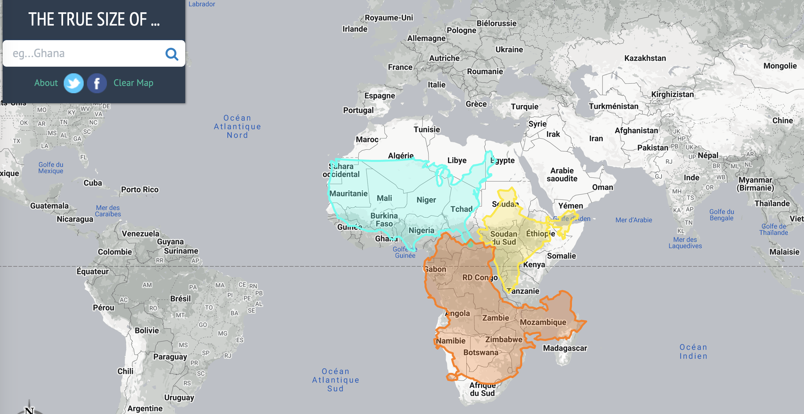

# 2 Spatial Data {#sec-spatial-data .unnumbered}

This blocks explore spatial data, old and new. We start with an overview of traditional datasets, discussing their benefits and challenges for social scientists; then we move on to new forms of data, and how they pose different challenges, but also exciting opportunities. These two areas are covered with clips and slides that can be complemented with readings. Once conceptual areas are covered, we jump into working with spatial data in `R` or `Python`, which will prepare you for your own adventure in exploring spatial data.

Slides can be downloaded ["here"](/html/spatial_data_gds.pdf)

## Special about spatial data

**All data is spatial** - data comes from observation, and observation needs to happen *somewhere* and at *some time*. This makes all data spatial. For a lot of data, the location expressed in spatial, earth-bound coordinates of observation is not of prime importance:

- If a patient undergoes a brain scan, the location of the scanner is not important; the location of the person relative to the scanner is.
- If a person receives a positive COVID-19 test result, the location of testing may not be important for the person's decision on whether to go into quarantine or not
- For someone trying to do contact tracing, this person's location history may be very relevant.

## Geometries

These core spatial geometries are all supported in `R` package `sf` and `Python` library `geopandas`.

- points
- lines
- polygons
- and their respective "multi" versions (which group entities of the same type into a single entity).

### Geometries

The basis of every type of geometry is the point. A point is simply a coordinate in 2D, 3D or 4D space such as:

\index{sf!point}

- `POINT (5 2)`

\index{sf!linestring} A line string is a sequence of points with a straight line connecting the points, for example:

- `LINESTRING (1 5, 4 4, 4 1, 2 2, 3 2)`

A polygon is a sequence of points that form a closed ring without intersection. Closed means that the first and the last point of a polygon have the same coordinates:

- `POLYGON ((1 5, 2 2, 4 1, 4 4, 1 5))`

A polygone with a hole: `POLYGON ((1 5, 2 2, 4 1, 4 4, 1 5), (2 4, 3 4, 3 3, 2 3, 2 4))` \index{sf!hole}

All types of objects:

::: {.panel-tabset group="language"}
## R

```{r sfcs, message=FALSE, fig.cap="Illustration of point, linestring and polygon geometries.", fig.asp=0.4}
library(sf)
old_par = par(mfrow = c(1, 3), pty = "s", mar = c(0, 3, 1, 0))
plot(st_as_sfc(c("POINT(5 2)")), axes = TRUE, main = "POINT")
plot(st_as_sfc("LINESTRING(1 5, 4 4, 4 1, 2 2, 3 2)"), axes = TRUE, main = "LINESTRING")
plot(st_as_sfc("POLYGON((1 5, 2 2, 4 1, 4 4, 1 5))"), col="gray", axes = TRUE, main = "POLYGON")
par(old_par)
```

## Python

```{python sfcs-py, message=FALSE, fig.cap="Illustration of point, linestring and polygon geometries."}
import geopandas as gpd
from shapely.geometry import Point, LineString, Polygon
import matplotlib.pyplot as plt

fig, axes = plt.subplots(1, 3, figsize=(9, 3))

gpd.GeoSeries([Point(5, 2)]).plot(ax=axes[0])
axes[0].set_title("POINT")

gpd.GeoSeries([LineString([(1, 5), (4, 4), (4, 1), (2, 2), (3, 2)])]).plot(ax=axes[1])
axes[1].set_title("LINESTRING")

gpd.GeoSeries([Polygon([(1, 5), (2, 2), (4, 1), (4, 4), (1, 5)])]).plot(ax=axes[2], color="gray")
axes[2].set_title("POLYGON")

plt.tight_layout()
plt.show()
```
:::

```{r polygon_hole, echo=FALSE, out.width="30%", eval=FALSE}
# not printed - enough of these figures already (RL)
par(pty = "s")
plot(st_as_sfc("POLYGON((1 5, 2 2, 4 1, 4 4, 1 5), (2 4, 3 4, 3 3, 2 3, 2 4))"), col = "gray", axes = TRUE, main = "POLYGON with a hole")
```

There are also:

- sets of polygons, `MULTIPOLYGON(((0 0,1 0,1 1,0 0)), ((3 3,4 3,4 4,3 3)))`

- combinations of these `GEOMETRYCOLLECTION(POINT(0 1),LINESTRING(0 0,1 1))`- which are inconvenient

## "Good old" (geo) data

To understand what is new in new forms of data, it is useful to begin by considering traditional data. Datasets utilized in the field of social sciences exhibit several key characteristics:

1.  **Purposeful Collection:** These datasets are meticulously designed and gathered with specific research objectives in mind.

2.  **Rich Information:** They provide a wealth of detailed and informative data, often offering a comprehensive "rich profile and portraits of the country" under examination.

3.  **High Quality:** Maintaining a high standard of data accuracy and integrity is a top priority in social science datasets.

However, it's important to note that these datasets also come with certain limitations:

1.  **Scale and Cost:** Building and maintaining such datasets can be massive undertakings, often requiring substantial financial resources.

2.  **Coarse Resolution:** To safeguard privacy, data may need to be aggregated, resulting in a loss of fine-grained detail.

3.  **Slowness:** The process of data collection, curation, and dissemination can be time-consuming, leading to delays in availability.

4.  **Frequency vs. Detail:** Typically, as datasets become more detailed, their availability may decrease, making it challenging to access highly specific data on a regular basis.

## New forms of (geo) data

New forms of (geo) data are tied into the geo-data revolution. Data is often accidental, which is initially generated for various purposes but becomes available for analysis as a side effect. This data is incredibly diverse, varying in resolution and quality, but holds the potential for much greater detail in both spatial and temporal dimensions.

Have a look at the two following articles:

- [Data ex Machina: Introduction to Big Data](https://www.annualreviews.org/doi/abs/10.1146/annurev-soc-060116-053457) by Lazer & Radford

- [Accidental, open and everywhere](https://www.sciencedirect.com/science/article/abs/pii/S0143622813002178) by Arribas-Bel

## All maps are wrong

<iframe width="560" height="315" src="https://www.youtube.com/embed/kIID5FDi2JQ?si=qo8s3JlTsF4JjAlx">

</iframe>

If you're still not convinced, try have a mess around with [this link](https://thetruesize.com/). Or, inspired by the 2026 UN vote below, try Al Jazeera's [country-size guessing quiz](https://interactive.aljazeera.com/aje/2026/new-world-map/indexmap.html) — pick which country you think is bigger, then watch it morph from Mercator to Equal Earth to see how close you were.



### Coordinates

With coordinates, we usually think a numbered measured along a ruler, where the ruler might be an imaginary line: it has an offset (0), a unit (m), and a constant direction. For spatial data we could have two imaginary lines perpendicular to each other, and we call this Cartesian space. Distance between $(x_1,y_1)$ and $(x_2,y_2)$ in Cartesian space is computed by Euclidean distance: $$\sqrt{(x_1-x_2)^2+(y_1-y_2)^2}$$

Left: geocentric coordinates (Cartesian, three-dimensional, units metres); Right: spherical/ellipsoidal coordinates (angles, units degrees)

```{r out.width='100%',echo=FALSE}
knitr::include_graphics("https://r-spatial.org/book/02-Spaces_files/figure-html/fig-sphere-1.png")
```

Euclidean distances **do not work** for ellipsoidal coordinates: one degree longitude at the equator is about 111 km, at the poles it is 0 km.

### What does *coordinate reference system* mean?

**CRSs** if disregarded can lead to massive problems. CRSs allow you to make the right assumptions without having to guess. They specify what coordinates mean.

"Data are not just numbers, they are numbers with a context" ([Cobb & Moore](https://www.jstor.org/stable/2975286?seq=1#metadata_info_tab_contents))

Coordinate reference systems provide the context of coordinates:

- They tell whether the coordinates are ellipsoidal (angles), or derived, projected (Cartesian) coordinates
- In case they are projected, they detail the kind of projection used, so that the underlying ellipsoidal coordinates can be recovered
- In **any** case, they point out which ellipsoidal model (datum) was used.

Knowing this we can:

- Convert between projected and unprojected, or to another projection
- Transform from one datum to another
- Combine the coordinates with any other coordinates that have a coordinate reference system

### Projection and transformation

Established CRSs captured by EPSG codes are well-suited for many applications. A long and growing list of projections has been developed. Here are a few examples applied to the world so you can see that maps do change quite a bit when different projections are applied.

First, let's load a world countries dataset — `world`, with a `continent` column — in both languages, so the rest of the examples can reuse it:

::: {.panel-tabset group="language"}
## R

```{r Mollweide1, warning=FALSE, message=FALSE}
library(sf)
if (!requireNamespace("spData", quietly = TRUE)) install.packages("spData")
library(spData) # provides the `world` sf object used throughout this section
```

## Python

```{python world-py, warning=FALSE, message=FALSE}
import geopandas as gpd

world = gpd.read_file(
    "https://raw.githubusercontent.com/nvkelso/natural-earth-vector/master/geojson/ne_110m_admin_0_countries.geojson"
)
world = world.rename(columns={"CONTINENT": "continent"})  # match R's spData::world naming
```
:::

**The Mollweide projection**.

::: {.panel-tabset group="language"}
## R

```{r Mollweide2, warning=FALSE}
#| code-fold: true
world_mollweide = st_transform(world, crs = "+proj=moll")
plot(world_mollweide["continent"])
```

## Python

```{python mollweide-py, warning=FALSE}
#| code-fold: true
world_mollweide = world.to_crs("+proj=moll")
world_mollweide.plot(column="continent")
plt.show()
```
:::

On the other hand, when mapping the world, it is often desirable to have as little distortion as possible for all spatial properties (area, direction, distance). One of the most popular projections to achieve as little distortion as possible is **the Winkel tripel projection**

::: {.panel-tabset group="language"}
## R

```{r wintri-r, warning=FALSE}
#| code-fold: true
world_wintri = lwgeom::st_transform_proj(world, crs = "+proj=wintri")
plot(world_wintri["continent"])
```

## Python

```{python wintri-py, warning=FALSE}
#| code-fold: true
world_wintri = world.to_crs("+proj=wintri")
world_wintri.plot(column="continent")
plt.show()
```
:::

Specific PROJ parameters can be modified in most CRS definitions - you will most likely never use this. The below code transforms the coordinates to **the Lambert azimuthal equal-area projection** centered on longitude and latitude of 0.

::: {.panel-tabset group="language"}
## R

```{r laea-r}
#| code-fold: true
world_laea1 = st_transform(world, 
                           crs = "+proj=laea +x_0=0 +y_0=0 +lon_0=0 +lat_0=0")
plot(world_laea1["continent"])
```

## Python

```{python laea-py}
#| code-fold: true
world_laea1 = world.to_crs("+proj=laea +x_0=0 +y_0=0 +lon_0=0 +lat_0=0")
world_laea1.plot(column="continent")
plt.show()
```
:::

### Replacing the Mercator Map with the Equal Earth Projection — disrupting a distortion

::: callout-note
## 🌐 In the news

On 4 September 2026, the UN General Assembly adopted the "Correct the Map" resolution — sponsored by Togo on behalf of the African Group and backed by the African Union — encouraging governments, schools, international organisations and technology companies to move away from the Mercator projection for general-purpose world maps, in favour of the **Equal Earth projection** or another equal-area map. The vote passed **164 to 1** (the United States voting against), with six abstentions (Estonia, Georgia, Lithuania, Moldova, Serbia and Ukraine).

The resolution is **non-binding**: it does not ban Mercator, which the sponsors note remains "fully suited" for maritime and aerial navigation, and it does not redraw a single border. Togo's Foreign Minister Robert Dussey told the Assembly that maps shape education, imagination and collective perception; Togo is also planning a follow-up meeting in Lomé in early 2027 with UNESCO, the African Union, and tech companies including Google to work out implementation. The vote wasn't unanimous in spirit either — the sole "no" vote, the United States, called it "the reason this institution is losing its credibility," with its representative arguing the Assembly should not be "debating map projects from the 16th century."

Sources: [UN News](https://news.un.org/en/story/2026/09/1168284), [The Guardian](https://www.theguardian.com/world/2026/sep/04/un-vote-world-map-mercator-equal-earth-africa), [Al Jazeera](https://www.aljazeera.com/news/2026/9/4/un-votes-to-adopt-new-world-map-that-reflects-africas-true-size), [CBC News](https://www.cbc.ca/news/science/united-nations-mercator-map-projection-africa-9.7332900) — also widely reported by the BBC and others.
:::

Why does this matter for us as (Geo-)Data Scientists? It's a live, high-profile example of exactly the CRS trade-off discussed above. Mercator is a **conformal** projection — it preserves local shape and angle, which is precisely why it was invented, for plotting a constant compass bearing as a straight line at sea. But preserving shape everywhere comes at a cost: area gets increasingly distorted the further you move from the Equator. On a Mercator map, **Greenland appears roughly the same size as Africa** — in reality, Africa is about **14 times larger**.

The Equal Earth projection, created in 2018 by cartographers Bojan Šavrič, Tom Patterson and Bernhard Jenny, is an **equal-area pseudocylindrical** projection: it preserves the relative surface area of landmasses, at the cost of some distortion in shape (particularly near the poles) — the opposite trade-off to Mercator.

**The EPSG codes** — since the news coverage doesn't mention them, here's the definitive list:

| CRS | EPSG code | Centred on |
|------------------------|------------------------|------------------------|
| Equal Earth (the projection *method*, not a full CRS) | `EPSG:1078` | — |
| WGS 84 / Equal Earth Greenwich | `EPSG:8857` | 0° (prime meridian) |
| WGS 84 / Equal Earth Americas | `EPSG:8858` | 90°W |
| WGS 84 / Equal Earth Asia-Pacific | `EPSG:8859` | 150°E |

For comparison, the two Mercator codes you're most likely to meet are `EPSG:3395` (World Mercator) and `EPSG:3857` (Web/Pseudo-Mercator — the one behind Google Maps, OpenStreetMap and most web tiles).

Let's reproject our `world` object into both and see the difference directly:

::: {.panel-tabset group="language"}
## R

```{r equal_earth, warning=FALSE}
#| code-fold: true
world_mercator = st_transform(world, crs = "EPSG:3395")
world_equalearth = st_transform(world, crs = "EPSG:8857")

old_par = par(mfrow = c(1, 2), pty = "s", mar = c(0, 1, 2, 1))
plot(world_mercator["continent"], main = "Mercator (EPSG:3395)", key.pos = NULL, reset = FALSE)
plot(world_equalearth["continent"], main = "Equal Earth (EPSG:8857)", key.pos = NULL, reset = FALSE)
par(old_par)
```

## Python

```{python equal-earth-py, warning=FALSE}
#| code-fold: true
world_mercator = world.to_crs("EPSG:3395")
world_equalearth = world.to_crs("EPSG:8857")

fig, axes = plt.subplots(1, 2, figsize=(10, 5))
world_mercator.plot(column="continent", ax=axes[0])
axes[0].set_title("Mercator (EPSG:3395)")
world_equalearth.plot(column="continent", ax=axes[1])
axes[1].set_title("Equal Earth (EPSG:8857)")
plt.tight_layout()
plt.show()
```
:::

::: callout-tip
Notice how much smaller Greenland becomes, and how much larger Africa and South America look, once we stop preserving angles and start preserving area. Same data, same underlying coordinates — just a different rule for flattening a sphere onto a page — and the story the map tells changes completely. This is exactly why choosing (and disclosing) a CRS is a substantive analytical decision, not a technicality.
:::

## **Further readings**

Watch: Nathan Yau's [Flowing Data](https://flowingdata.com/)

- [The Problem with our maps](https://www.visualcapitalist.com/problem-with-our-maps/) by Nick Routely
- [Geocomputation with R](https://geocompr.robinlovelace.net/index.html)
- [Spatial Data Science](https://r-spatial.org/book/)
- ["Can you guess the real size of each country on the new world map?"](https://www.aljazeera.com/news/2026/9/6/can-you-guess-the-real-size-of-each-country-on-the-new-world-map) — Al Jazeera, interactive
- ["UN vote on world map"](https://www.theguardian.com/world/2026/sep/04/un-vote-world-map-mercator-equal-earth-africa) — The Guardian
